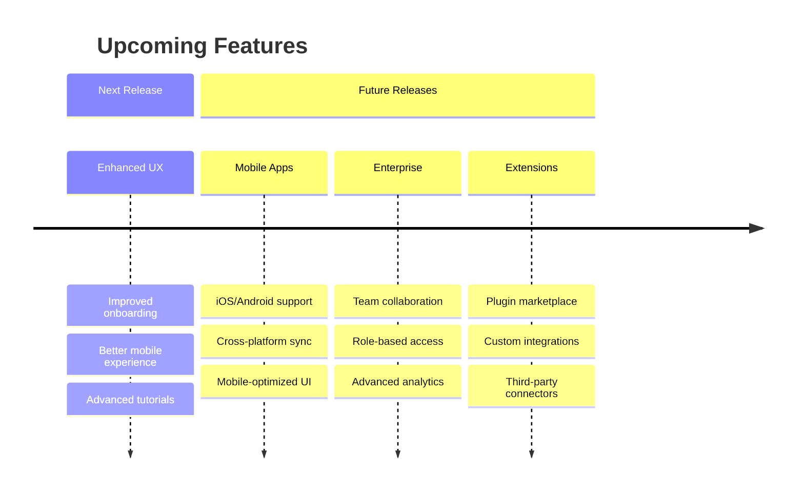
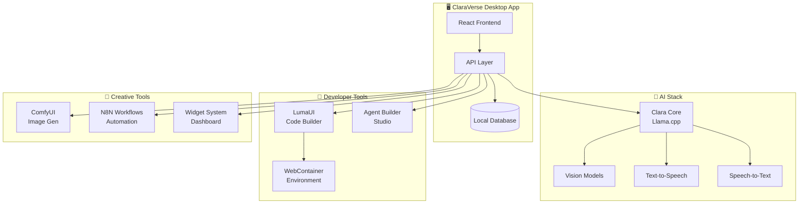

<div align="center">
  
  
  # 🚀 ClaraVerse
  
  ### **Your Fully Local AI Superstack — Privacy-First, Cloud-Free, Limitless**
  
  *ClaraVerse isn't just another chat UI. It's a complete AI ecosystem that runs 100% on your machine.*
  
  <p>
    
    
    
    
  </p>
  
  <p>
    <a href="https://claraverse.space/" target="_blank">
      
    </a>
    <a href="https://claraverse.space/" target="_blank">
      
    </a>
    <a href="https://discord.gg/j633fsrAne" target="_blank">
      
    </a>
    <a href="https://www.reddit.com/r/claraverse/" target="_blank">
      
    </a>
  </p>
  
  <p>
    <strong>💬 LLM Chat • 🧠 AI Agents • 🔄 Automation • 🎨 Image Gen • 🧩 App Builder • 🧱 Widgets</strong><br/>
    <em>Powered by open-source, privacy-first, zero-cloud technology</em>
  </p>

  💡 Heads up: ClaraVerse is in early development. Expect some rough edges while we build toward stability.

  
</div>

---

## 🌟 **What Makes ClaraVerse Special?**

> **Clara is what happens when you give Ollama, N8N, and OpenInterpreter a shared brain — and run them offline with a beautiful UI.**

ClaraVerse is a **complete AI development suite** that runs entirely on your machine. No cloud. No API keys. No data leaving your computer. Ever.

### 🎯 **Built for Everyone**
- **Developers**: Full-stack AI development environment
- **Creators**: Visual workflow automation and image generation
- **Privacy Advocates**: 100% local processing, no telemetry
- **Businesses**: Self-hosted AI infrastructure without vendor lock-in

---

## 🚀 **Feature Universe**

<table>
<tr>
<td width="50%">

### 🧠 **Clara AI Assistant**
- **Advanced Chat Interface** with vision model support
- **File Processing** - documents, images, code
- **Voice Integration** - TTS/STT capabilities
- **Context Awareness** - remembers your conversations
- **Multi-Provider Support** - Ollama, OpenAI, OpenRouter

</td>
<td width="50%">

### 🧩 **LumaUI Code Builder**
- **WebContainer-Powered** development environment
- **Live Preview** with Monaco editor
- **AI Code Generation** and assistance
- **Project Templates** - React, Vue, Vanilla JS
- **Real-time Synchronization**

</td>
</tr>
<tr>
<td width="50%">

### 🔄 **N8N Automation Hub**
- **1000+ Workflow Templates**
- **Drag-and-Drop** automation builder
- **Webhook Testing** and tool creation
- **Native Integration** - no external setup
- **Visual Workflow Designer**

</td>
<td width="50%">

### 🎨 **ComfyUI Image Studio**
- **Local Stable Diffusion** - SDXL, SD 1.5, Flux
- **LoRA & ControlNet** support
- **Model Management** with download progress
- **Prompt Enhancement** using local LLMs
- **Image Gallery** with metadata

</td>
</tr>
<tr>
<td width="50%">

### 🧠 **Agent Builder Studio**
- **Visual Flow Programming** with React Flow
- **Custom Node Creation** - Auto & Manual modes
- **Real-time Execution** with debugging
- **Import/Export** agent workflows
- **Template Library** with prebuilt agents

</td>
<td width="50%">

### 🧱 **Dynamic Widget System**
- **Draggable Dashboard** with grid layout
- **Custom Widget Types** - Chat, Email, Flow, Webhook
- **Persistent Configurations**
- **Context Menu Management**
- **Real-time Updates**

</td>
</tr>
</table>

---

## 📸 **Visual Showcase**

<details>
<summary><strong>🖼️ Click to see screenshots</strong></summary>

### 💬 **AI Assistant Interface**


### 🧩 **LumaUI Code Builder**


### 🔄 **N8N Automation Studio**


### 🎨 **Image Generation Lab**


### 🧱 **Widget Dashboard**


</details>

---

## 🆚 **Clara vs The Competition**

| Feature | **ClaraVerse** | OpenWebUI | LibreChat | Ollama WebUI |
|---------|----------------|-----------|-----------|--------------|
| 💻 **100% Local Stack** | ✅ Complete | ✅ Yes | ✅ Yes | ✅ Basic |
| 🧩 **Visual App Builder** | ✅ Built-in | ❌ No | ❌ No | ❌ No |
| 🔄 **Native Automation** | ✅ N8N Integrated | ❌ No | ❌ No | ❌ No |
| 🧠 **Agent Builder** | ✅ Visual Designer | ❌ No | ❌ No | ❌ No |
| 🎨 **Image Generation** | ✅ ComfyUI | ✅ Basic DALL-E | ❌ No | ❌ No |
| 🧱 **Widget System** | ✅ Dynamic Dashboard | ❌ No | ✅ Basic | ❌ No |
| 🔧 **Code Execution** | ✅ OpenInterpreter | ❌ No | ❌ No | ❌ No |
| 📱 **Desktop App** | ✅ Electron | ❌ Web Only | ❌ Web Only | ❌ Web Only |

---

## 🗓️ **Release Timeline & Roadmap**

<div align="center">

### **🎯 Current Release Status**

| **Component** | **Status** | **Description** |
|---------------|------------|-----------------|
| 🧠 **Clara AI Assistant** | ✅ **Released** | Advanced chat interface with multi-provider support |
| 🧩 **LumaUI Code Builder** | ✅ **Released** | WebContainer-powered development environment |
| 🧱 **Widget System** | ✅ **Released** | Dynamic dashboard with draggable widgets |
| 🔄 **N8N Integration** | ✅ **Released** | Native workflow automation |
| 🎨 **Image Generation** | ✅ **Released** | ComfyUI integration for local Stable Diffusion |
| 🧠 **Agent Builder** | ✅ **Released** | Visual flow programming for AI agents |
| 📱 **Desktop Apps** | ✅ **Released** | Windows, macOS, Linux support |
| 🐳 **Docker Deployment** | ✅ **Released** | One-command local deployment |

### **🚀 Coming Soon**



</div>

---

## 🚀 **Quick Start**

### 💻 **Desktop App**

<table>
<tr>
<td align="center">

<br/><strong>Windows</strong><br/>
<a href="https://github.com/badboysm890/ClaraVerse/releases/latest">

</a>
</td>
<td align="center">

<br/><strong>macOS</strong><br/>
<a href="https://github.com/badboysm890/ClaraVerse/releases/latest">

</a>
</td>
<td align="center">

<br/><strong>Linux</strong><br/>
<a href="https://github.com/badboysm890/ClaraVerse/releases/latest">

</a>
</td>
</tr>
</table>

### 🛠️ **Development Setup**
```bash
# Install dependencies
npm install

# Development server
npm run dev           # Web version
npm run electron:dev  # Desktop version

# Build for production
npm run build              # Web build
npm run electron:build     # Desktop build
```

---

## 🔐 **Privacy & Security**

<div align="center">

| 🛡️ **Privacy Feature** | **Status** | **Details** |
|------------------------|------------|-------------|
| **Local Processing** | ✅ 100% | All AI models run on your machine |
| **No Telemetry** | ✅ Zero | No data collection or phone home |
| **Open Source** | ✅ Full | Complete codebase transparency |
| **Self-Hosted** | ✅ Complete | Own your entire AI stack |
| **No Cloud APIs** | ✅ Optional | Cloud providers only if you choose |
| **Encrypted Storage** | ✅ Built-in | Local data encrypted by default |

</div>

> **Your Data, Your Rules**: ClaraVerse processes everything locally. Your conversations, files, and generated content never leave your machine unless you explicitly choose to use cloud providers.

---

## 🏗️ **Architecture Overview**

<div align="center">



</div>

---

## 🌍 **Community & Support**

<div align="center">

### **Join the ClaraVerse Community**

<table>
<tr>
<td align="center">

<br/><strong>GitHub</strong><br/>
<a href="https://github.com/badboysm890/ClaraVerse">Issues & PRs</a>
</td>
<td align="center">

<br/><strong>Discord</strong><br/>
<a href="https://discord.gg/j633fsrAne">Live Chat</a>
</td>
<td align="center">

<br/><strong>Reddit</strong><br/>
<a href="https://www.reddit.com/r/claraverse/">Community</a>
</td>
<td align="center">

<br/><strong>Twitter</strong><br/>
<a href="https://twitter.com/intent/tweet?text=Clara%20is%20a%20fully%20offline%20AI%20superstack%20with%20LLMs%2C%20automations%2C%20agents%2C%20image%20generation%20%2B%20more%20%E2%80%94%20all%20open-source.%20Get%20it%20here%20%F0%9F%91%87&url=https%3A%2F%2Fgithub.com%2Fbadboysm890%2FClaraVerse">Share Clara</a>
</td>
</tr>
</table>

### **Get Help & Share Ideas**
- 🐛 **Bug Reports**: [GitHub Issues](https://github.com/badboysm890/ClaraVerse/issues)
- 💡 **Feature Requests**: [GitHub Discussions](https://github.com/badboysm890/ClaraVerse/discussions)
- 📧 **Direct Contact**: [praveensm890@gmail.com](mailto:praveensm890@gmail.com)
- 🔥 **Show & Tell**: Share your workflows, agents, and creations!

</div>

---

## 🤝 **Contributing**

We love contributions! Here's how you can help make ClaraVerse even better:

### **🌟 Ways to Contribute**
- ⭐ **Star the repository** to show your support
- 🐛 **Report bugs** and suggest improvements
- 📝 **Improve documentation** and tutorials
- 🧩 **Create new templates** for agents and workflows
- 🎨 **Design new widgets** and UI components
- 🔧 **Add new features** and integrations

### **🛠️ Development Guidelines**
1. Fork the repository
2. Create a feature branch: `git checkout -b feature/amazing-feature`
3. Make your changes and test thoroughly
4. Commit with clear messages: `git commit -m 'Add amazing feature'`
5. Push to your branch: `git push origin feature/amazing-feature`
6. Open a Pull Request with detailed description

---

## 📊 **GitHub Stats**

<div align="center">

[](https://star-history.com/#badboysm890/ClaraVerse&Date)

<p>
  
  
  
  
</p>

</div>

---

## 📜 **License**

ClaraVerse is open-source software licensed under the [MIT License](LICENSE). This means you can:

- ✅ Use it commercially
- ✅ Modify and distribute
- ✅ Use it privately
- ✅ Contribute back to the community

---

## 🚀 **Ready to Launch Your AI Journey?**

<div align="center">

**ClaraVerse gives you the complete local AI stack — no vendor lock-in, no API hell, no GPU bills.**

<p>
  <a href="https://claraverse.space/" target="_blank">
    
  </a>
</p>

### **Clara's your rocket. Light it up. 🚀**

<sub>Made with ❤️ by the ClaraVerse community</sub>

</div>

---

<div align="center">

*"The future of AI is local, private, and in your hands."*

**⭐ Star us on GitHub • 🗨️ Join our Discord • 🎯 Follow our journey**

</div> 
