<div align="center">
  
  
  # 🚀 ClaraVerse
  
  ### **The Complete Local AI Superstack**
  ### **Privacy-First • Cloud-Free • Infinitely Capable**
  
  <p>
    
    
    
    
  </p>
  
  <p>
    <a href="https://claraverse.space/" target="_blank">
      
    </a>
    <a href="https://github.com/badboysm890/ClaraVerse/releases/latest" target="_blank">
      
    </a>
    <a href="https://discord.gg/j633fsrAne" target="_blank">
      
    </a>
    <a href="https://www.reddit.com/r/claraverse/" target="_blank">
      
    </a>
  </p>
  
  ---
  
  ### 🎯 **Our Mission**
  
  **To democratize AI development by making powerful AI tools accessible to everyone — without compromising privacy, requiring expensive cloud services, or sacrificing functionality.**
  
  ---
  
  <p>
    <strong>🤖 AI Assistant • � Code Builder • 🔄 Automation • 🎨 Image Gen • � Agents • 🧱 Widgets</strong><br/>
    <em>All running 100% on your machine — Your data, Your rules, Your AI</em>
  </p>

</div>

---

## ✨ **The Vision Behind ClaraVerse**

> **What if you could have the power of a complete AI development studio — without ever sending your data to the cloud?**

ClaraVerse is our answer to that question. Born from the belief that **AI should empower, not exploit**, we've built a complete AI ecosystem that:

- 🔒 **Respects Your Privacy** — Everything runs locally, nothing leaves your machine
- 💰 **Saves Your Money** — No API fees, no cloud bills, no subscription traps  
- 🚀 **Maximizes Your Potential** — Professional-grade tools accessible to everyone
- 🌍 **Builds Community** — Open-source, extensible, and collaborative

## 🎯 **How ClaraVerse Works**

<div align="center">

### **Six Integrated AI Powerhouses — One Unified Experience**

</div>

<table>
<tr>
<td width="50%" align="center">

### � **Clara AI Assistant**
*Your intelligent coding companion*

**What it does:**
- Advanced conversations with context memory
- Code generation, analysis & debugging  
- File processing (docs, images, code)
- Autonomous task execution
- Voice-enabled interactions

**How it works:**
Powered by multiple AI providers (Ollama, OpenAI, Anthropic) with local-first architecture

</td>
<td width="50%" align="center">

### 🧩 **LumaUI Code Builder**
*Full-stack web development suite*

**What it does:**
- WebContainer-powered dev environment
- Live preview with Monaco editor
- AI-assisted code generation
- React, Vue, Vanilla JS projects
- Real-time collaboration

**How it works:**
Browser-based development environment with integrated AI assistance

</td>
</tr>
<tr>
<td width="50%" align="center">

### 🔄 **N8N Automation Hub**
*Visual workflow automation*

**What it does:**
- 1000+ service integrations
- Drag-and-drop workflow builder
- Webhook & API automation
- Data processing pipelines
- Scheduled task execution

**How it works:**
Native N8N integration running locally in your ClaraVerse instance

</td>
<td width="50%" align="center">

### 🎨 **ComfyUI Image Studio**
*Local Stable Diffusion powerhouse*

**What it does:**
- SDXL, SD 1.5, Flux model support
- LoRA & ControlNet capabilities
- Batch generation & upscaling
- Prompt enhancement with AI
- Image gallery with metadata

**How it works:**
ComfyUI integration running on your local GPU/CPU for complete privacy

</td>
</tr>
<tr>
<td width="50%" align="center">

### 🧠 **Agent Builder Studio**
*Visual AI agent creation*

**What it does:**
- React Flow-based visual editor
- Custom node creation (auto & manual)
- Real-time execution & debugging
- Agent template library
- Import/export workflows

**How it works:**
Drag-and-drop interface for creating complex AI agent workflows

</td>
<td width="50%" align="center">

### 🧱 **Dynamic Widget System**
*Customizable dashboard experience*

**What it does:**
- Draggable grid layout dashboard
- Chat, Email, Flow, Webhook widgets
- Persistent configurations
- Context menu management
- Real-time updates

**How it works:**
React-grid-layout powered dashboard with WebSocket real-time updates

</td>
</tr>
</table>

### 🔄 **The Integration Magic**

All components share a unified API layer and communicate through:
- **Shared Context**: Your conversations, projects, and preferences sync across all tools
- **Cross-Feature Workflows**: Generate code with Clara → Build with LumaUI → Automate with N8N → Deploy
- **Unified Settings**: One configuration system for all AI providers and preferences

---

## 🎯 **Why ClaraVerse Over Alternatives?**

<div align="center">

| **Capability** | **🚀 ClaraVerse** | OpenWebUI | LibreChat | Ollama WebUI |
|:---------------|:------------------|:----------|:----------|:-------------|
| **🤖 Local AI Stack** | ✅ **Complete Ecosystem** | ✅ Basic Chat | ✅ Basic Chat | ✅ Basic Chat |
| **🧩 Code Builder** | ✅ **Full IDE + AI** | ❌ None | ❌ None | ❌ None |
| **🔄 Visual Automation** | ✅ **N8N Integrated** | ❌ None | ❌ None | ❌ None |
| **🧠 Agent Builder** | ✅ **Visual Designer** | ❌ None | ❌ None | ❌ None |
| **🎨 Image Generation** | ✅ **Full ComfyUI** | ❌ None | ❌ None | ❌ None |
| **🧱 Widget Dashboard** | ✅ **Dynamic Layout** | ❌ None | ✅ Basic | ❌ None |
| **📱 Desktop Apps** | ✅ **Cross-Platform** | ❌ Web Only | ❌ Web Only | ❌ Web Only |
| **🔒 Privacy Guarantee** | ✅ **100% Local** | ✅ Yes | ✅ Yes | ✅ Yes |

*ClaraVerse isn't just a chat interface — it's your complete AI development studio*

</div>

---

## 🚀 **Get Started in Minutes**

<div align="center">

### **Choose Your Experience**

<table>
<tr>
<td align="center" width="33%">

### 💻 **Desktop App**
*Full-featured experience*

<p>


</p>

**[Download Latest Release](https://github.com/badboysm890/ClaraVerse/releases/latest)**

`Windows • macOS • Linux`

</td>
<td align="center" width="33%">

### 🐳 **Docker Deployment**
*One-command setup*

```bash
docker run -p 3000:3000 \
  claraverse/claraverse:latest
```

**Perfect for servers & teams**

</td>
<td align="center" width="33%">

### 🛠️ **Development Build**
*Latest features*

```bash
git clone https://github.com/badboysm890/ClaraVerse
npm install && npm run dev
```

**For contributors & early adopters**

</td>
</tr>
</table>

</div>

### ⚡ **Quick Setup Guide**

1. **Download** → Install ClaraVerse for your platform
2. **Launch** → Complete the 2-minute onboarding
3. **Configure** → Add your AI providers (optional - works offline!)
4. **Create** → Start your first project or chat with Clara

*🎉 You're ready to build amazing things!*

---

## � **Privacy & Security Promise**

<div align="center">

### **Your Data, Your Rules — Always**

| 🛡️ **Privacy Feature** | **Status** | **How We Ensure It** |
|:----------------------|:-----------|:---------------------|
| **🖥️ Local Processing** | ✅ **100%** | All AI models run exclusively on your machine |
| **🚫 Zero Telemetry** | ✅ **Guaranteed** | No analytics, tracking, or data collection |
| **🔓 Open Source** | ✅ **Fully Transparent** | Every line of code is auditable |
| **🏠 Self-Hosted** | ✅ **Complete Control** | You own your entire AI infrastructure |
| **🌐 Optional Cloud** | ✅ **Your Choice** | External APIs only when you explicitly enable them |
| **🔐 Encrypted Storage** | ✅ **By Default** | All local data encrypted with industry standards |

</div>

> **🌟 The ClaraVerse Promise**: We believe AI should enhance your capabilities without compromising your privacy. That's why everything runs locally by default — your conversations, files, and creative work never leave your machine unless you explicitly choose cloud providers.

---

## 🏗️ **Under the Hood: Architecture**

```mermaid
graph TB
    subgraph "🖥️ ClaraVerse Desktop App"
        UI[React Frontend<br/>Beautiful, Responsive Interface]
        API[Unified API Layer<br/>Cross-Component Communication]
        DB[(Local Database<br/>SQLite + File Storage)]
    end
    
    subgraph "🧠 Local AI Stack"
        LLM[Clara Core<br/>Llama.cpp Engine]
        VISION[Vision Models<br/>Image Understanding]
        TTS[Text-to-Speech<br/>Voice Generation]
        STT[Speech-to-Text<br/>Voice Recognition]
    end
    
    subgraph "🔧 Development Tools"
        LUMA[LumaUI<br/>WebContainer Environment]
        AGENT[Agent Builder<br/>Visual Flow Designer]
        WEB[Monaco Editor<br/>Live Preview System]
    end
    
    subgraph "🎨 Creative & Automation"
        COMFY[ComfyUI<br/>Stable Diffusion Engine]
        N8N[N8N Workflows<br/>Automation Engine]
        WIDGETS[Widget System<br/>Dynamic Dashboard]
    end
    
    UI --> API
    API --> LLM
    API --> LUMA
    API --> AGENT
    API --> COMFY
    API --> N8N
    API --> WIDGETS
    LLM --> VISION
    LLM --> TTS
    LLM --> STT
    LUMA --> WEB
    API --> DB
    
    style UI fill:#4A90E2,stroke:#fff,stroke-width:2px,color:#fff
    style LLM fill:#FF6B6B,stroke:#fff,stroke-width:2px,color:#fff
    style COMFY fill:#4ECDC4,stroke:#fff,stroke-width:2px,color:#fff
    style N8N fill:#45B7D1,stroke:#fff,stroke-width:2px,color:#fff
```

<div align="center">



**Key Design Principles:**
- 🔄 **Unified Communication**: All components share context through a central API
- 🧩 **Modular Architecture**: Each tool operates independently but integrates seamlessly  
- 🔒 **Security-First**: Local processing with optional cloud connectivity
- ⚡ **Performance-Optimized**: Efficient resource usage and background processing

</div>

---

## 🌍 **Join the ClaraVerse Community**

<div align="center">

### **Connect, Share, Build Together**

<table>
<tr>
<td align="center" width="25%">

<br/><strong>GitHub</strong><br/>
<a href="https://github.com/badboysm890/ClaraVerse">🐛 Issues & PRs</a><br/>
<sub>Report bugs, request features</sub>
</td>
<td align="center" width="25%">

<br/><strong>Discord</strong><br/>
<a href="https://discord.gg/j633fsrAne">💬 Live Community</a><br/>
<sub>Real-time help & discussions</sub>
</td>
<td align="center" width="25%">

<br/><strong>Reddit</strong><br/>
<a href="https://www.reddit.com/r/claraverse/">🗨️ r/claraverse</a><br/>
<sub>Share creations & get support</sub>
</td>
<td align="center" width="25%">

<br/><strong>X (Twitter)</strong><br/>
<a href="https://twitter.com/intent/tweet?text=Clara%20is%20a%20fully%20offline%20AI%20superstack%20with%20LLMs%2C%20automations%2C%20agents%2C%20image%20generation%20%2B%20more%20%E2%80%94%20all%20open-source.%20Get%20it%20here%20%F0%9F%91%87&url=https%3A%2F%2Fgithub.com%2Fbadboysm890%2FClaraVerse">🐦 Share Clara</a><br/>
<sub>Spread the word</sub>
</td>
</tr>
</table>

### **🆘 Get Help When You Need It**
- � **[Complete Documentation](https://github.com/badboysm890/ClaraVerse/tree/main/docs)** — Comprehensive guides for every feature
- 🐛 **[GitHub Issues](https://github.com/badboysm890/ClaraVerse/issues)** — Bug reports and feature requests  
- 💬 **[Discord Support](https://discord.gg/j633fsrAne)** — Real-time community assistance
- 📧 **Direct Contact**: [praveensm890@gmail.com](mailto:praveensm890@gmail.com)

</div>

---

## 🤝 **Contributing to ClaraVerse**

We believe the best software is built by communities. Here's how you can help shape ClaraVerse:

### **🌟 Ways to Contribute**
- ⭐ **Star the repository** to show your support
- 🐛 **Report bugs** and suggest improvements via GitHub Issues
- 📝 **Improve documentation** — help others discover ClaraVerse's potential
- 🧩 **Create templates** for agents, workflows, and projects
- 🎨 **Design new widgets** and UI components
- 🔧 **Add features** that solve real problems
- 💰 **Support development** via [Buy Me a Coffee](https://buymeacoffee.com) (see credits below)

### **🚀 Quick Contribution Guide**
1. **Fork** the repository on GitHub
2. **Create** a feature branch: `git checkout -b feature/amazing-feature`  
3. **Make** your changes and test thoroughly
4. **Commit** with clear messages: `git commit -m 'Add amazing feature'`
5. **Push** to your branch: `git push origin feature/amazing-feature`
6. **Open** a Pull Request with a detailed description

---

## 📊 **Community Growth**

<div align="center">

[](https://star-history.com/#badboysm890/ClaraVerse&Date)

<p>
  
  
  
  
</p>

</div>

---

## 🙏 **Credits & Acknowledgments**

ClaraVerse stands on the shoulders of giants. We're deeply grateful to these amazing projects and communities:

### **� Core Technologies**
- **[llama.cpp](https://github.com/ggml-org/llama.cpp)** — The backbone of our local AI inference engine
- **[llama-swap](https://github.com/mostlygeek/llama-swap)** — Inspiration for efficient model management
- **[faster-whisper](https://github.com/SYSTRAN/faster-whisper)** — Powers our speech-to-text capabilities

### **💝 Community Support**
- **💰 Buy Me a Coffee Contributors** — Thank you to everyone who has supported our development through donations
- **👥 GitHub Contributors** — Every bug report, feature request, and pull request makes ClaraVerse better
- **💬 Discord Community** — Your feedback, ideas, and conversations drive our development priorities
- **🌟 Early Adopters** — Thank you for believing in the vision and helping us improve

### **🎯 Special Thanks**
To every developer, creator, and privacy advocate who has contributed to making ClaraVerse a reality. Your support, whether through code, feedback, testing, or simply using ClaraVerse, is what makes this project possible.

---

## �📜 **License**

ClaraVerse is open-source software licensed under the [MIT License](LICENSE). This means you can:

- ✅ **Use commercially** — Build your business on ClaraVerse
- ✅ **Modify freely** — Adapt it to your specific needs  
- ✅ **Distribute widely** — Share your improvements with the world
- ✅ **Contribute back** — Help make ClaraVerse better for everyone

---

## 🚀 **Ready to Launch Your AI Journey?**

<div align="center">

### **ClaraVerse: Your Complete Local AI Stack**
### **No Vendor Lock-in • No API Fees • No Compromises**

<p>
  <a href="https://github.com/badboysm890/ClaraVerse/releases/latest" target="_blank">
    
  </a>
</p>

---

### **🌟 "The future of AI is local, private, and in your hands."**

<sub>Made with ❤️ by the ClaraVerse community</sub>

**⭐ Star us on GitHub • � Join our Discord • 🎯 Follow our journey**

</div> 
