<div align="center">

<br/>

<picture>
  <source media="(prefers-color-scheme: dark)" srcset="/public/logo.png">
  <source media="(prefers-color-scheme: light)" srcset="/public/logo.png">
  
</picture>

<br/>
<br/>

# **ClaraVerse**

<h3>
  <em>The Complete AI Ecosystem That <b>Actually</b> Respects Your Privacy</em>
</h3>

<p align="center">
  <a href="https://github.com/badboysm890/ClaraVerse/stargazers">
    
  </a>
</p>

[](https://www.buymeacoffee.com/claraverse)


<br/>

[](https://github.com/badboysm890/ClaraVerse/stargazers)
[](https://github.com/badboysm890/ClaraVerse/releases)
[](https://discord.gg/j633fsrAne)
[](LICENSE)
[](https://github.com/badboysm890/ClaraVerse/releases/latest)

<br/>

<p align="center">
  <kbd><strong>8 AI Tools</strong></kbd> ×
  <kbd><strong>1 App</strong></kbd> ×
  <kbd><strong>100% Local</strong></kbd> =
  <kbd><strong>∞ Possibilities</strong></kbd>
</p>

<br/>

<a href="https://github.com/badboysm890/ClaraVerse/releases/latest">
  
</a>
&nbsp;
<a href="https://claraverse.space/">
  
</a>


</div>

---

<br/>

## 💭 **The Story Behind ClaraVerse**

> **"Why can't everything be in a single app? Why do we need to jump between different AI tools and pay multiple subscriptions?"**

**Here's what happened to us (and probably you too):**

We found ourselves constantly jumping between different AI apps — tired of paying for Claude subscriptions, then installing LM Studio for local models, then N8N for automation, then Ollama for model management, then OpenWebUI for a better chat interface...

When using Ollama, downloading models was the only way to get started — but then we were stuck with limited chat features. LM Studio was good for models, but the chat experience felt basic. We'd end up running everything in the background while building UIs and generating images separately.

**That's when it hit us: Why can't everything be in a single app?**

ClaraVerse is our answer to that question.

> ClaraVerse is not another OpenWebUI (which is excellent for chat) or Ollama - everything is just scattered around and I'm trying to build a single app where people can just install it and use it. 

<br/>

## 🎯 **The Problem**

<div align="center">

| **The Subscription Hell** 💸 | **The Context-Loss Nightmare** 🔄 |
|:---|:---|
| • Claude Pro: **$20/month**<br/>• ChatGPT Plus: **$20/month**<br/>• GitHub Copilot: **$10/month**<br/>• Midjourney: **$10/month**<br/>• N8N Cloud: **$20/month**<br/><br/>**Total: $960/year** 😱 | • Chat in Claude → Code in VScode<br/>• Prompt in LLM → Use it in ComfyUI<br/>• Deploy with Ollama → Run in OpenWebUI<br/><br/>**Lost context with every switch** 🤦 |

</div>

<br/>

## ✨ **The Solution: ClaraVerse**

<div align="center">

### **One App. Six Tools. Zero Compromises.**

<br/>

<table>
<tr>
<td align="center" width="33%">
  
  <br/>
  
  
  ### **Clara AI**
  **Smart Assistant**
  
  `Advanced Chat` `Code Gen`
  `Voice` `Files` `MCP Tools` `Model Manager`
  
  <br/>
  
</td>
<td align="center" width="33%">

  <br/>
  
  
  ### **LumaUI**
  **Code Builder**
  
  `Live Preview` `WebContainer`
  `React/Vue/JS` `Hot Reload`

  <br/>

</td>
<td align="center" width="33%">

  <br/>
  
  
  ### **ComfyUI**
  **Image Studio**
  
  `SDXL/Flux` `LoRA` 
  `Batch Gen` `100% Private`

  <br/>

</td>
</tr>
<tr>
<td align="center" width="33%">

  <br/>
  
  
  ### **N8N**
  **Automation**
  
  `Visual Workflows` `1000+ APIs`
  `Scheduling` `Data Pipelines`

  <br/>

</td>
<td align="center" width="33%">

  <br/>
  
  
  ### **Agent Studio**
  **AI Agents**
  
  `Autonomous Agents` `MCP Integration`
  `Visual Designer` `Custom Nodes`

  <br/>

</td>
<td align="center" width="33%">

  <br/>
  
  
  ### **Community**
  **Sharing Hub**
  
  `Content Sharing` `Custom Nodes`
  `Workflows` `Collaboration`

  <br/>

</td>
</tr>
<tr>
<td align="center" width="33%">

  <br/>
  
  
  ### **Widgets**
  **Dashboard**
  
  `Drag & Drop` `Live Updates`
  `Persistent` `Customizable`

  <br/>

</td>
<td align="center" width="33%">

  <br/>
  
  
  ### **MCP Ecosystem**
  **Tool Integration**
  
  `20+ MCP Servers` `Desktop Automation`
  `Browser Control` `File System`

  <br/>

</td>
<td align="center" width="33%">

  <br/>

</td>
</tr>
</table>

</div>

<br/>

## 🔐 **Privacy First, Always**

<div align="center">

```diff
+ 100% Local Processing     Your data never leaves your machine
+ Zero Telemetry            We can't see what you're doing
+ Open Source               Every line of code is auditable
+ Works Offline             No internet? No problem!
```

</div>

<br/>

## 🚀 **Quick Start**

### **Option 1: Desktop App** (Recommended)

<div align="center">

[](https://github.com/badboysm890/ClaraVerse/releases/latest)
[](https://github.com/badboysm890/ClaraVerse/releases/latest)
[](https://github.com/badboysm890/ClaraVerse/releases/latest)

</div>

### **Option 2: Development Build**

```bash
# Clone the repository
git clone https://github.com/badboysm890/ClaraVerse.git
cd ClaraVerse

# Install dependencies
npm install

# Run in development mode
npm run electron:dev:hot
```

### **Option 3: Docker** 🐳

```bash
# Coming soon!
```

<br/>

## 📊 **Why ClaraVerse?**

<div align="center">

| Feature | ClaraVerse | Others |
|:--------|:----------:|:------:|
| **All-in-One Platform** | ✅ | ❌ |
| **100% Local Processing** | ✅ | ❌ |
| **No Subscriptions** | ✅ | ❌ |
| **Context Sharing** | ✅ | ❌ |
| **Community Hub** | ✅ | ❌ |
| **Autonomous Agents** | ✅ | ⚠️ |
| **MCP Tool Ecosystem** | ✅ | ❌ |
| **Open Source** | ✅ | ⚠️ |
| **Offline Mode** | ✅ | ❌ |
| **Custom Models** | ✅ | ⚠️ |
| **Enterprise Ready** | ⌛ | 💰 |

</div>

<br/>

## 🏗️ **Architecture**

```mermaid
graph LR
    A[🎨 React UI] --> B[⚡ Unified API]
    B --> C[🧠 Clara Core]
    B --> D[🔧 LumaUI]
    B --> E[🎨 ComfyUI]
    B --> F[🔄 N8N]
    B --> G[🤖 Agent Studio]
    B --> H[📊 Widgets]
    B --> I[👥 Community]
    B --> J[🔗 MCP Ecosystem]
    
    C --> K[Llama.cpp]
    C --> L[Vision]
    C --> M[Voice]
    
    G --> N[Autonomous Agents]
    G --> O[Visual Designer]
    
    J --> P[Desktop Automation]
    J --> Q[Browser Control]
    J --> R[File System]
    
    style A fill:#4A90E2
    style C fill:#FF6B6B
    style E fill:#4ECDC4
    style G fill:#9B59B6
    style I fill:#E67E22
    style J fill:#27AE60
```

<div align="center">



</div>

<br/>

## 🌟 **Features Roadmap**

<div align="center">

| Status | Feature | ETA |
|:-------|:--------|:----|
| ✅ | Clara AI Assistant | **Released** |
| ✅ | LumaUI Code Builder | **Released** |
| ✅ | ComfyUI Integration | **Released** |
| ✅ | N8N Workflows | **Released** |
| ✅ | Agent Studio (Advanced) | **Released** |
| ✅ | Community Hub | **Released** |
| ✅ | MCP Ecosystem (20+ Servers) | **Released** |
| 🚧 | Docker Image for Remote servers | Q3 2025 |
| 🚧 | Mobile App with Offline Support | Q3 2025 |
| 🚧 | Cloud Sync (Optional) | Q4 2025 |
| 📋 | Plugin Marketplace | Q4 2025 |
| 📋 | Team Collaboration | Q4 2025 |

</div>
  
> **🚧 Development Status**  
> ClaraVerse is actively evolving! While core features are stable, some components may change as we work toward v1.0. We prioritize stability but welcome your feedback on improvements and new features. Join our [Discord](https://discord.gg/j633fsrAne) to stay updated! 🚀

<br/>

## 🤝 **Community & Support**

<div align="center">

[](https://discord.gg/j633fsrAne)
[](https://www.reddit.com/r/claraverse/)
[](https://twitter.com/claraverse)
[](https://youtube.com/@claraverse)

### **📚 Resources**

[Documentation](https://github.com/badboysm890/ClaraVerse/tree/main/docs) • 
[API Reference](https://github.com/badboysm890/ClaraVerse/tree/main/docs/api) • 
[Tutorials](https://github.com/badboysm890/ClaraVerse/tree/main/docs/tutorials) • 
[FAQ](https://github.com/badboysm890/ClaraVerse/wiki/FAQ)

</div>

<br/>

## 💝 **Contributors**

<div align="center">

<!-- ALL-CONTRIBUTORS-LIST:START -->
<a href="https://github.com/badboysm890/ClaraVerse/graphs/contributors">
  
</a>
<!-- ALL-CONTRIBUTORS-LIST:END -->

### **How to Contribute**

We love contributions! Check our [Contributing Guide](CONTRIBUTING.md) to get started.

```mermaid
graph LR
    A[🍴 Fork] --> B[🔧 Code]
    B --> C[✅ Test]
    C --> D[📤 PR]
    D --> E[🎉 Merge]
```



</div>

<br/>

## 🙏 **Acknowledgments**

<div align="center">

**Built on the shoulders of giants:**

[llama.cpp](https://github.com/ggml-org/llama.cpp) • 
[llama-swap](https://github.com/mostlygeek/llama-swap) • 
[faster-whisper](https://github.com/SYSTRAN/faster-whisper) • 
[ComfyUI](https://github.com/comfyanonymous/ComfyUI) • 
[N8N](https://github.com/n8n-io/n8n)

### **Special Thanks**

☕ **Coffee Supporters** • 🌟 **Star Gazers** • 🐛 **Bug Hunters** • 💡 **Feature Suggesters**

</div>

<br/>

## 📄 **License**

<div align="center">

**MIT License** - Use it, modify it, sell it, we don't mind! (If want you to give credit, that would be awesome but not mandatory 😉)

See [LICENSE](LICENSE) for details.

</div>

---

<div align="center">

<br/>

### **🚀 Ready to revolutionize your AI workflow?**

<br/>

<a href="https://github.com/badboysm890/ClaraVerse/releases/latest">
  
</a>

<br/>
<br/>

**⭐ Star us** • **🍴 Fork us** • **💬 Join us**

<br/>

<sub>Made with ❤️ by developers who believe privacy is a right, not a privilege</sub>

<br/>

</div>

<br/>
<br/>

<div align="center">

## 💭 **A Note From The Developer regarding incomplete features, bugs and docs**

</div>

<div align="center">

### **Building ClaraVerse**

<br/>

<table>
<tr>
<td align="center" width="50%">


### **Solo Developer**

`9-6 Day Job` `Night Coding` 
`Weekend Builds` `3 AM Commits`

**One person. Three platforms.**
**Just having fun in doing this.**

</td>
<td align="center" width="50%">


### **Community Heroes**

`Discord Testers` `Bug Hunters`
`Coffee Supporters` `PR Contributors`

**You make this possible.**
**Every single day.**

</td>
</tr>
</table>

<br/>

<details>
<summary><kbd><strong>📖 Read the Full Story</strong></kbd></summary>

<br/>

> **"Why are some docs incomplete? Why does this feature need work?"**

Here's the honest truth...

I'm a **single developer** building ClaraVerse during nights and weekends while working a **9-6 day job**. I'm maintaining **3 platforms**, fixing bugs, adding features, answering Discord questions, reviewing PRs, and somehow trying to keep documentation updated.

<br/>

### **🌟 The Amazing People Making This Possible**

<table>
<tr>
<td align="center">

**💬 Discord Community**
<br/>
<sub>UI Testing • Feature Ideas • Bug Reports</sub>

</td>
<td align="center">

**👨‍💻 @aruntemme**
<br/>
<sub>ClaraCore Dev • Notebook Features</sub>

</td>
<td align="center">

**☕ Coffee Supporters**
<br/>
<sub>Keeping 3 AM Sessions Alive</sub>

</td>
<td align="center">

**🐛 Issue Reporters**
<br/>
<sub>Detailed Reports • Patience</sub>

</td>
</tr>
</table>

<br/>

**The Reality Check:**
- Docs written with **Claude & GPT** during my **2-3 hours of free time**
- Some nights too exhausted to write proper commit messages
- Every feature request matters, but time is limited
- Your patience literally keeps this project alive

<br/>

<div align="center">

**🙏 Thank you for being part of this crazy journey**

*Building an AI platform alone is insane.*
*Your support makes it possible.*

<sub>— @badboysm890, probably debugging at 3 AM ☕</sub>

</div>

</details>

</div>

<br/>

---

<br/>

## ❓ **Frequently Asked Questions**

<div align="center">

### **Quick Answers to Common Questions**

<p align="center">
  <kbd>Installation</kbd> ×
  <kbd>Models</kbd> ×
  <kbd>Features</kbd> ×
  <kbd>Troubleshooting</kbd>
</p>

</div>

<br/>

<details>
<summary>
  <kbd><strong>🚀 Installation & Setup</strong></kbd>
</summary>

<br/>

<table>
<tr>
<td width="50%">

### **System Requirements**

| Platform | Requirements |
|:---------|:------------|
| **Windows** | Win 10/11 • 8GB RAM |
| **macOS** | 10.15+ • M1/Intel |
| **Linux** | Ubuntu 18.04+ • FUSE |

</td>
<td width="50%">

### **Common Issues**

**🛡️ Windows Protection Warning?**
```
More Info → Run Anyway
(App is safe but unsigned)
```

**🍎 macOS Won't Open?**
```bash
sudo xattr -r -d com.apple.quarantine \
  /Applications/ClaraVerse.app
```

</td>
</tr>
</table>

</details>

<details>
<summary>
  <kbd><strong>🤖 AI Models & Performance</strong></kbd>
</summary>

<br/>

<table>
<tr>
<td width="50%">

### **Model Compatibility**

✅ **Auto-Import From:**
- Ollama models
- LM Studio models
- GGUF files
- Custom models

❌ **Not Required:**
- OpenAI API keys
- Cloud subscriptions
- Internet connection

</td>
<td width="50%">

### **Performance Tips**

**Clara AI Not Responding?**
1. Check AI provider settings
2. Switch to different model
3. Ensure Ollama running: `ollama serve`
4. Restart ClaraVerse

**Memory Optimization:**
- Use smaller models (7B vs 70B)
- Close unused tabs
- Restart periodically

</td>
</tr>
</table>

</details>

<details>
<summary>
  <kbd><strong>🎨 Features & Development</strong></kbd>
</summary>

<br/>

<table>
<tr>
<td width="50%">

### **LumaUI Issues**

**Project Won't Start?**
- Restart ClaraVerse
- Clear app cache
- Check 4GB+ RAM available
- Close heavy applications

**Build Errors?**
- Update dependencies
- Check console logs
- Try simpler project first

</td>
<td width="50%">

### **Image Generation**

**Generation Fails?**
- Reduce resolution (512x512)
- Check GPU memory (6GB+)
- Close GPU applications
- Try CPU mode (slower)

**Quality Issues?**
- Increase steps (20-50)
- Try different models
- Adjust CFG scale

</td>
</tr>
</table>

<details>
<summary><sub>💡 <strong>Pro Tip: Multi-Tool Usage</strong></sub></summary>

<br/>

You can run **all tools simultaneously** - that's the magic of ClaraVerse! 
Clara AI + LumaUI + ComfyUI can all share context and work together.

</details>

</details>

<details>
<summary>
  <kbd><strong>🤖 Autonomous Agents & MCP</strong></kbd>
</summary>

<br/>

<table>
<tr>
<td width="50%">

### **Autonomous Agent Features**

✅ **Self-Executing Workflows**
- Autonomous task execution
- Multi-step reasoning
- Error self-correction
- Chain-of-thought processing

✅ **MCP Tool Integration**
- 20+ available MCP servers
- Desktop automation
- Browser control
- File system access

</td>
<td width="50%">

### **Community Features**

**🌟 Content Sharing:**
- Share custom nodes
- Download workflows
- Community templates
- Security scanning

**🔧 Agent Studio:**
- Visual workflow builder
- Drag-and-drop interface
- Custom node development
- Real-time testing

</td>
</tr>
</table>

</details>

<br/>

<div align="center">

### **Quick Fixes for Common Problems**

</div>

<table>
<tr>
<td align="center" width="25%">


**High Memory?**

<sub>
• Close unused tabs<br/>
• Use smaller models<br/>
• Reduce batch sizes<br/>
• Restart periodically
</sub>

</td>
<td align="center" width="25%">


**Network Issues?**

<sub>
• Check firewall<br/>
• Try different network<br/>
• Use offline mode<br/>
• Verify antivirus
</sub>

</td>
<td align="center" width="25%">


**GPU Problems?**

<sub>
• Update drivers<br/>
• Check CUDA version<br/>
• Monitor VRAM usage<br/>
• Try CPU fallback
</sub>

</td>
<td align="center" width="25%">


**App Crashes?**

<sub>
• Check error logs<br/>
• Reinstall app<br/>
• Clear cache/data<br/>
• Report on GitHub
</sub>

</td>
</tr>
</table>

<br/>

<div align="center">

### **🆘 Still Need Help?**

<a href="https://github.com/badboysm890/ClaraVerse/tree/main/docs">
  
</a>
&nbsp;
<a href="https://github.com/badboysm890/ClaraVerse/issues">
  
</a>
&nbsp;
<a href="https://discord.gg/j633fsrAne">
  
</a>

</div>

</details>

<br/>

<div align="center">

<sub>Can't find your answer? Join our <a href="https://discord.gg/j633fsrAne">Discord</a> for real-time help!</sub>

</div>

<br/>
