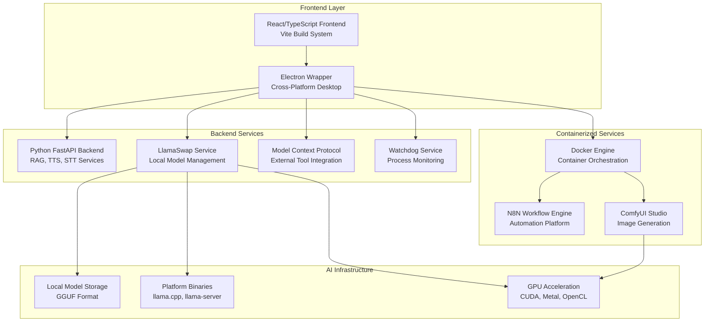
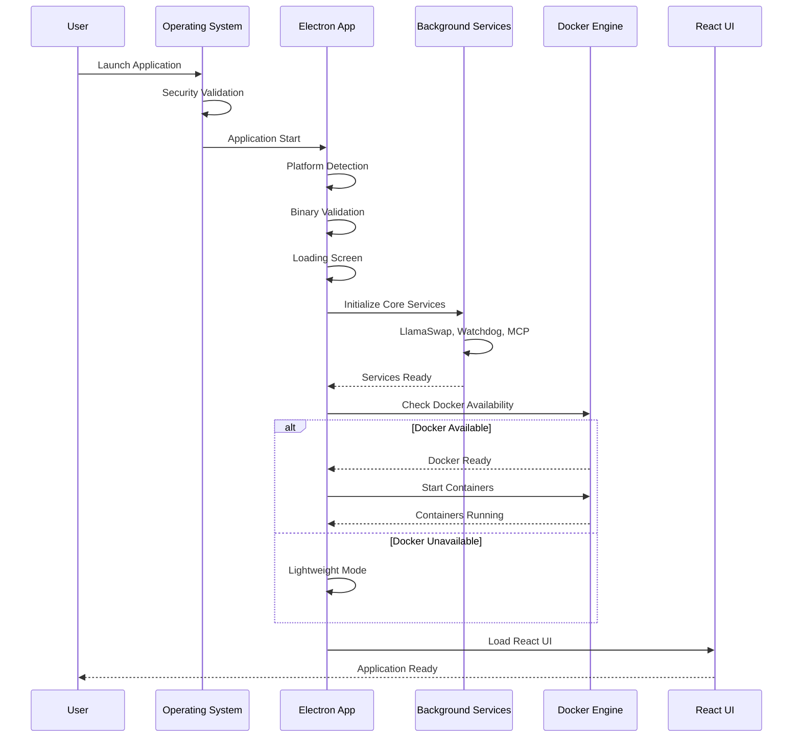
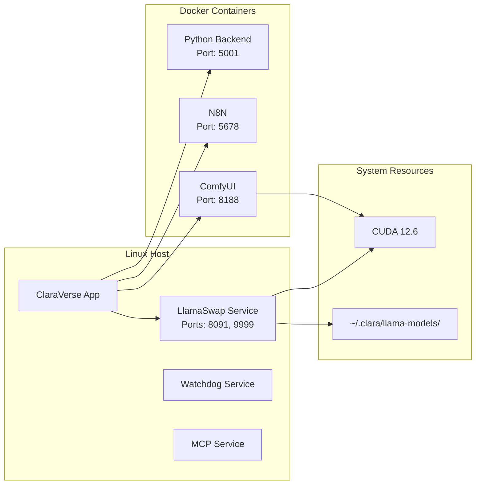
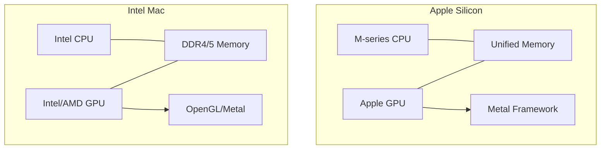
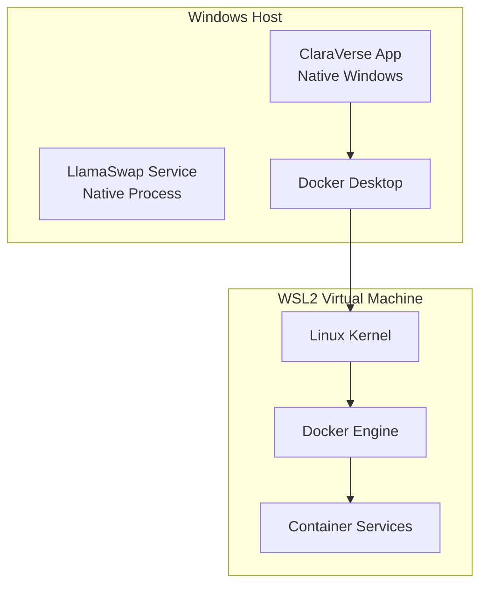
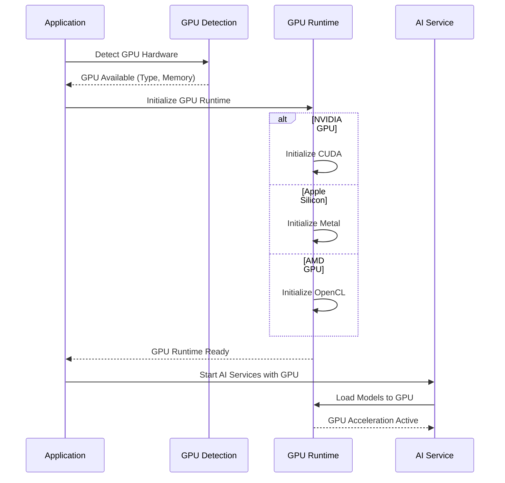
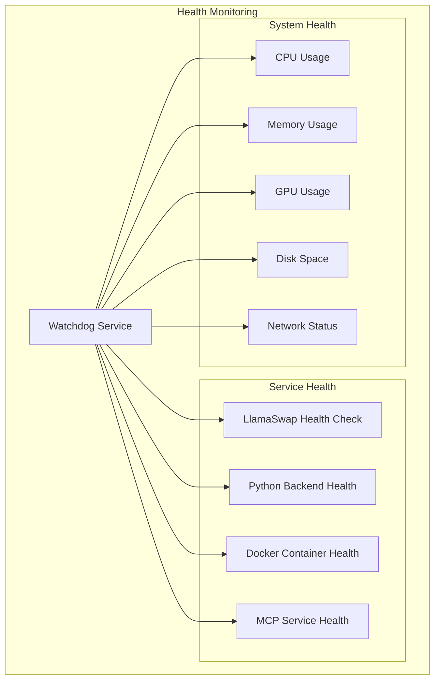
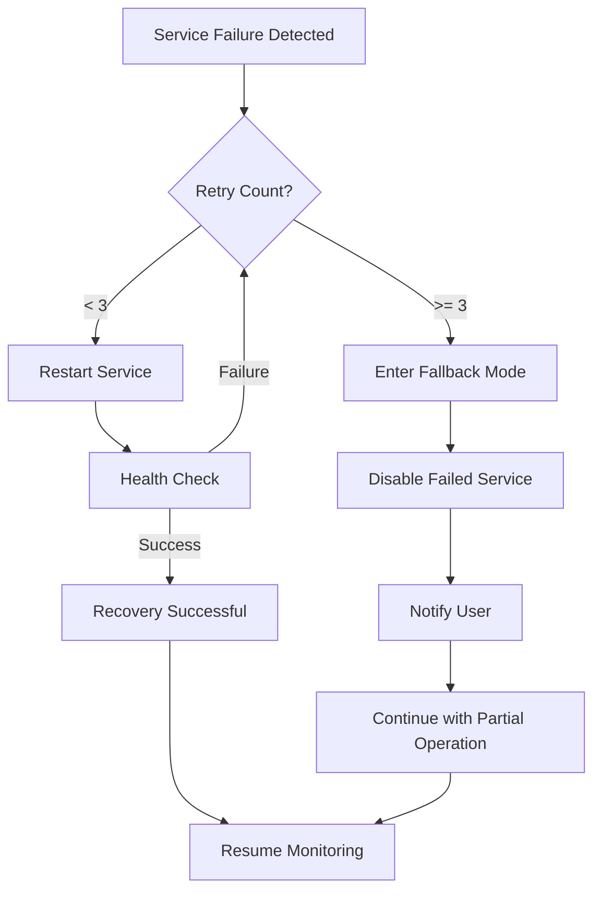

# ClaraVerse Platform Startup Analysis

## Executive Summary

Based on comprehensive analysis of the ClaraVerse application codebase, this document provides detailed flow diagrams and documentation for how the application starts up on each supported platform (Linux, macOS, Windows), including all background services, their responsibilities, and platform-specific implementation details.

## Application Architecture Overview

ClaraVerse is a comprehensive, privacy-first AI superstack that runs 100% locally on user machines. It's not just a chat UI but a full-blown AI assistant, workflow engine, agent builder, and image lab.

### Core Components



## Service Responsibilities

### Core Services

1. **Electron Main Process (`electron/main.cjs`)**
   - Application orchestration and lifecycle management
   - Platform detection and binary selection
   - Service initialization and health monitoring
   - IPC communication between frontend and backend
   - Docker container management
   - Security and update management

2. **React Frontend (`src/App.tsx`)**
   - User interface and interaction
   - Multi-tab application (Chat, LumaUI, Agent Studio, etc.)
   - Real-time communication with backend services
   - Local storage and session management

3. **LlamaSwap Service (`electron/llamaSwapService.cjs`)**
   - Dynamic model swapping and management
   - GPU-accelerated inference (CUDA, Metal, OpenCL)
   - Model proxy server (ports 8091, 9999, 9998)
   - Platform-specific binary execution
   - Resource optimization and memory management

4. **Python Backend (`py_backend/main.py`)**
   - FastAPI server (port 5000/5001)
   - RAG system with LightRAG integration
   - Speech-to-text using Whisper models
   - Text-to-speech with multiple engines
   - Document processing and embedding generation

5. **Watchdog Service (`electron/watchdogService.cjs`)**
   - Process monitoring and health checking
   - Automatic service recovery
   - Performance metrics collection
   - System resource monitoring

6. **MCP Service (`electron/mcpService.cjs`)**
   - Model Context Protocol implementation
   - External tool integration
   - Standardized communication interface

### Containerized Services

7. **N8N Automation (`clara_n8n` container)**
   - Workflow automation platform (port 5678)
   - 1000+ prebuilt workflow templates
   - API integrations and webhook support
   - Visual workflow builder

8. **ComfyUI Studio (`clara_comfyui` container)**
   - Advanced image generation (port 8188)
   - Stable Diffusion model support
   - Custom node ecosystem
   - GPU-accelerated inference

## Platform-Specific Startup Flows

### Universal Startup Sequence



### Linux Platform Details

**File**: `docs/platform-flows/linux-flow.md` (See full documentation)

**Key Characteristics:**
- Native performance with full CUDA 12.6 support
- Docker containers run natively on Linux kernel
- Optimal performance and resource utilization
- Advanced GPU acceleration for both inference and image generation

**Service Architecture:**


### macOS Platform Details

**File**: `docs/platform-flows/mac-flow.md` (See full documentation)

**Key Characteristics:**
- Dual architecture support (Apple Silicon M-series + Intel)
- Metal GPU acceleration for Apple Silicon
- Docker Desktop integration via HyperKit VM
- Native macOS security integration (Gatekeeper, Notarization)

**Architecture Differences:**


### Windows Platform Details

**Key Characteristics:**
- WSL2 integration for Docker containers
- Native Windows services with Win32 API
- NVIDIA CUDA and AMD OpenCL support
- Windows Registry configuration storage

**WSL2 Integration:**


## Service Port Mapping

| Service | Internal Port | External Port | Protocol | Purpose |
|---------|---------------|---------------|----------|---------|
| React Frontend | N/A | N/A | Internal | User Interface |
| Python Backend | 5000 | 5001 | HTTP | RAG/TTS/STT API |
| N8N Automation | 5678 | 5678 | HTTP | Workflow Management |
| ComfyUI Studio | 8188 | 8188 | HTTP/WebSocket | Image Generation |
| LlamaSwap Main | N/A | 8091 | HTTP | Model Management |
| LlamaSwap Proxy | 9999 | 9999 | HTTP | Model Inference |
| LlamaSwap Embed | 9998 | 9998 | HTTP | Embedding Models |

## Configuration Management

### File System Structure
```
~/.clara/                          # Main application data (Linux/macOS)
%APPDATA%\clara-verse\            # Main application data (Windows)
├── llama-models/                 # Local model storage (GGUF files)
├── python/                       # Python backend data
├── n8n/                         # N8N workflow data
├── comfyui_models/              # ComfyUI model storage
├── comfyui_output/              # Generated images
├── pull_timestamps.json        # Docker pull tracking
└── lightrag_storage/           # RAG system data
```

### Model Configuration (LlamaSwap)
```yaml
# electron/llamacpp-binaries/config.yaml
models:
  "deepseek-r1-0528:8b":
    proxy: "http://127.0.0.1:9999"
    cmd: |
      "llama-server"
      -m "model.gguf"
      --port 9999 --jinja --n-gpu-layers 50
      --threads 8 --ctx-size 32768
      --batch-size 256 --ubatch-size 256
    ttl: 300

groups:
  "embedding_models":
    swap: false
    exclusive: false
    persistent: true
  "regular_models":
    swap: true
    exclusive: true
```

## GPU Acceleration Support

### Platform-Specific GPU Support

1. **Linux**: NVIDIA CUDA 12.6, AMD ROCm
2. **macOS**: Apple Metal (M-series), OpenGL/Metal (Intel)
3. **Windows**: NVIDIA CUDA, AMD OpenCL, DirectX

### GPU Acceleration Flow


## Health Monitoring System



## Error Handling & Recovery

### Service Recovery Flow


## Performance Optimizations

### CPU Optimizations
- Multi-threading with platform-specific thread counts
- SIMD optimizations (AVX2, SSE4.2, NEON)
- CPU-specific binary selection
- Memory mapping and caching

### GPU Optimizations
- Platform-specific GPU acceleration
- Model persistence in GPU memory
- Batch processing optimization
- Memory pressure handling

### Memory Management
- Model swapping based on usage patterns
- Defragmentation and garbage collection
- Resource pooling and reuse
- Platform-specific memory optimizations

## Security Considerations

### Platform Security Integration
1. **Linux**: Native process isolation, systemd integration
2. **macOS**: Gatekeeper, code signing, notarization, Keychain
3. **Windows**: UAC, Windows Defender, SmartScreen, Registry

### Data Privacy
- 100% local execution (no cloud dependencies)
- Encrypted local storage for sensitive data
- Secure credential management per platform
- No data transmission to external servers

## Deployment Modes

### Full Docker Mode
- All services running in containers
- Complete feature set available
- Higher resource usage
- Best performance and isolation

### Lightweight Mode
- Native services only (LlamaSwap, Watchdog, MCP)
- Reduced feature set
- Lower resource usage
- Fallback when Docker unavailable

### Minimal Mode
- Frontend UI only
- Local model inference disabled
- Emergency fallback mode
- Allows basic configuration and troubleshooting

## Troubleshooting Framework

### Common Issues Across Platforms
1. **Docker Not Available**: Automatic fallback to lightweight mode
2. **Port Conflicts**: Dynamic port allocation and conflict resolution
3. **GPU Not Detected**: Graceful fallback to CPU inference
4. **Model Loading Failures**: Retry mechanisms and error reporting
5. **Permission Issues**: Platform-specific permission handling

### Platform-Specific Troubleshooting
- **Linux**: CUDA drivers, Docker daemon, file permissions
- **macOS**: Gatekeeper blocking, Docker Desktop VM issues, Metal support
- **Windows**: WSL2 installation, UAC permissions, Windows Defender exclusions

## Conclusion

ClaraVerse represents a sophisticated, multi-platform AI application that successfully balances performance, security, and user experience across Linux, macOS, and Windows. The architecture's modularity allows for graceful degradation when certain services are unavailable, while platform-specific optimizations ensure optimal performance on each operating system.

The comprehensive startup flow analysis reveals a well-architected system that prioritizes:
- **Reliability**: Multiple fallback modes and error recovery
- **Performance**: Platform-specific optimizations and GPU acceleration
- **Security**: Integration with platform security systems
- **User Experience**: Seamless startup and clear error messaging
- **Privacy**: 100% local execution with no cloud dependencies

This analysis provides the technical foundation for understanding, maintaining, and extending the ClaraVerse platform across all supported operating systems. 