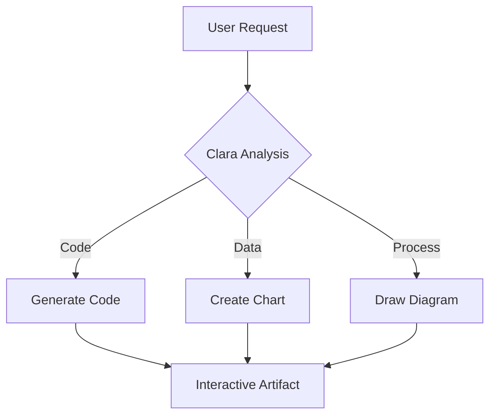

# 🤖 Clara Assistant

Clara is your intelligent AI coding companion built into ClaraVerse. More than just a chatbot, Clara is a sophisticated assistant capable of autonomous work, file processing, code generation, and creative collaboration.

## 🌟 What Makes Clara Special?

Clara combines the best of modern AI with practical development tools:

- **Multi-Provider Support** - Works with OpenAI, Anthropic, Ollama, and OpenRouter
- **Autonomous Execution** - Can work independently with tool calling
- **File Intelligence** - Processes documents, images, and code files
- **Background Operation** - Continues working while you focus elsewhere
- **Artifact Generation** - Creates interactive charts, diagrams, and visualizations
- **Voice Integration** - Text-to-Speech and Speech-to-Text capabilities

## 🎯 Core Capabilities

### 💬 Intelligent Conversation

**Natural Language Understanding:**
- Context-aware responses
- Multi-turn conversation memory
- Technical and creative discussions
- Code explanation and documentation

**Advanced Features:**
```typescript
// Clara understands context across conversations
User: "I'm building a React app with authentication"
Clara: "I'll help you implement authentication. What type of auth do you prefer?"

User: "JWT tokens"
Clara: "Perfect! I'll create a JWT auth system with login/signup forms..."

// Later in the conversation
User: "Add password reset functionality"
Clara: "I'll extend the existing JWT auth system with password reset..."
```

### 🛠️ Code Understanding and Generation

**Code Analysis:**
- Review code quality and performance
- Identify bugs and security issues
- Suggest optimizations and refactoring
- Explain complex algorithms

**Code Generation:**
```typescript
// Clara can generate complete components
User: "Create a reusable modal component with animations"

Clara: "I'll create a flexible modal component with Framer Motion animations..."
// Generates complete TypeScript React component with props, animations, and styling
```

**Supported Languages:**
- JavaScript/TypeScript
- Python
- React/Vue/Angular
- HTML/CSS
- Node.js
- And 50+ more languages

### 📁 File Processing

**Document Analysis:**
- PDF document summarization
- Markdown parsing and conversion
- Text extraction and analysis
- Code file understanding

**Image Processing:**
- Image description and analysis
- Extract text from images (OCR)
- Visual content understanding
- Design feedback and suggestions

**Code File Operations:**
- Multi-file project analysis
- Dependency tracking
- Architecture recommendations
- Refactoring suggestions

## 🎨 Artifact System

Clara's artifact system automatically creates interactive visualizations and components when they enhance understanding:

### 📊 Data Visualizations

**Automatic Chart Generation:**
```javascript
User: "Show me the sales data as a chart"
Clara: "I'll create an interactive chart for your sales data..."

// Clara generates:
{
  "type": "bar",
  "data": {
    "labels": ["January", "February", "March", "April"],
    "datasets": [{
      "label": "Sales ($)",
      "data": [12000, 15000, 18000, 22000],
      "backgroundColor": ["#3B82F6", "#10B981", "#F59E0B", "#EF4444"]
    }]
  }
}
```

### 🔄 Mermaid Diagrams

**Process Flows and Architecture:**


### 📋 Interactive Tables

**Data Organization:**
```csv
Feature,Status,Priority,Assignee
Authentication,Complete,High,John
Dashboard,In Progress,Medium,Sarah
API Integration,Pending,High,Mike
Testing,Planned,Low,Team
```

## 🚀 Autonomous Mode

Clara can work independently to complete complex tasks:

### How Autonomous Mode Works

1. **Task Planning**: Clara breaks down complex requests into steps
2. **Tool Execution**: Uses available tools to complete each step
3. **Progress Monitoring**: Tracks progress and adapts to challenges
4. **Result Validation**: Verifies work quality before completion

**Example Autonomous Task:**
```
User: "Build a complete todo application with React and TypeScript"

Clara's Autonomous Process:
1. 📋 Plan application structure
2. 🎨 Create component hierarchy
3. 💾 Implement state management
4. 🎯 Add CRUD operations
5. 🎨 Style with Tailwind CSS
6. 🧪 Add basic testing
7. ✅ Validate and document
```

### Tool Integration

**Available Tools:**
- File creation and editing
- Code execution and testing
- Web research and data gathering
- Image generation and processing
- API calls and integrations

**Tool Call Example:**
```typescript
// Clara can chain multiple tools
1. create_file("components/TodoList.tsx", todoListCode)
2. create_file("hooks/useTodos.ts", customHookCode)
3. edit_file("App.tsx", integrateComponents)
4. run_command("npm test")
5. create_file("README.md", documentation)
```

## 🔊 Voice Integration

### Text-to-Speech (TTS)

**Natural Voice Output:**
- Multiple voice options
- Adjustable speed and pitch
- Background reading capability
- Code pronunciation optimization

**Usage:**
```typescript
// Clara reads responses aloud
User: "Explain async/await in JavaScript"
Clara: [Provides detailed explanation with voice narration]

// Configure TTS settings
Settings → Voice → Enable TTS
- Voice: Natural/Professional/Friendly
- Speed: 0.5x to 2.0x
- Pitch: -10 to +10
```

### Speech-to-Text (STT)

**Voice Input:**
- Hands-free interaction
- Code dictation
- Natural language commands
- Multi-language support

**Voice Commands:**
```
"Clara, create a new React component called UserProfile"
"Explain the code in the current file"
"Generate a function to sort an array of objects"
"Add error handling to this API call"
```

## 🎛️ Customization

### System Prompts

**Custom Behavior:**
Clara's behavior can be customized with system prompts:

```typescript
// Professional mode
"You are a senior software engineer focused on best practices, performance, and maintainable code."

// Creative mode
"You are a creative developer who thinks outside the box and suggests innovative solutions."

// Teaching mode
"You are a patient coding instructor who explains concepts clearly with examples."
```

### Provider Configuration

**Multi-Provider Setup:**
```typescript
// Local AI (Ollama)
- Model: llama2, codellama, mistral
- Endpoint: http://localhost:11434
- Benefits: Privacy, no cost, offline capable

// OpenAI
- Models: GPT-4, GPT-3.5-turbo
- Features: Function calling, vision
- Benefits: High quality, fast responses

// Anthropic (Claude)
- Models: Claude-3.5-Sonnet, Claude-3-Haiku
- Features: Long context, reasoning
- Benefits: Excellent code understanding

// OpenRouter
- Access to 100+ models
- Pay-per-use pricing
- Benefits: Model variety, cost flexibility
```

## 📚 Advanced Features

### Session Management

**Conversation Persistence:**
- Automatic session saving
- Cross-session context
- Conversation history
- Session export/import

**Session Types:**
```typescript
// Quick Chat: Ephemeral conversations
// Project Session: Tied to specific projects
// Research Session: For exploration and learning
// Debug Session: For troubleshooting
```

### Background Operation

**Continuous Operation:**
Clara can continue working while you focus on other tasks:

- **Background Processing**: Long-running tasks continue
- **Progress Notifications**: Updates on task completion
- **Queue Management**: Multiple tasks in sequence
- **Resource Management**: Efficient system usage

### Model Context Protocol (MCP)

**External Tool Integration:**
Clara can integrate with external tools and services:

```typescript
// Available MCP Tools
- File system operations
- Git version control
- Database queries
- API testing
- Cloud services
- Development tools
```

## 🎯 Best Practices

### Effective Communication

**Clear Instructions:**
```
✅ Good: "Create a React component for a user profile card with name, email, avatar, and edit button"

❌ Vague: "Make a user component"
```

**Context Provision:**
```
✅ Good: "In this React TypeScript project using Tailwind CSS, add dark mode toggle to the navigation bar"

❌ Limited: "Add dark mode"
```

### Task Optimization

**Breaking Down Complex Tasks:**
```typescript
// Instead of: "Build a complete e-commerce site"
// Try: 
1. "Create product listing component"
2. "Add shopping cart functionality"
3. "Implement checkout process"
4. "Add user authentication"
```

**Iterative Development:**
```typescript
// Progressive refinement
1. "Create basic todo app structure"
2. "Add styling and animations"
3. "Implement data persistence"
4. "Add advanced features"
```

## 🔧 Troubleshooting

### Common Issues

**Clara Not Responding:**
- Check AI provider connection
- Verify API keys in settings
- Test with different provider
- Restart ClaraVerse if needed

**Poor Response Quality:**
- Use more specific prompts
- Provide more context
- Try different models
- Check model configuration

**Autonomous Mode Issues:**
- Ensure tool permissions are enabled
- Check file system access
- Verify WebContainer is running
- Review error logs in debug mode

### Performance Optimization

**Response Speed:**
- Use faster models (GPT-3.5 vs GPT-4)
- Reduce context length
- Enable response streaming
- Use local models (Ollama)

**Memory Usage:**
- Clear conversation history regularly
- Limit file attachments size
- Use efficient prompt strategies
- Monitor system resources

## 🎉 Getting Started with Clara

### Quick Start Checklist

1. **Basic Setup**
   - [ ] Configure at least one AI provider
   - [ ] Test connection with simple question
   - [ ] Explore the chat interface

2. **File Processing**
   - [ ] Upload a document for analysis
   - [ ] Try image description
   - [ ] Process a code file

3. **Code Assistance**
   - [ ] Ask for code review
   - [ ] Request function generation
   - [ ] Get debugging help

4. **Advanced Features**
   - [ ] Try autonomous mode
   - [ ] Experiment with artifacts
   - [ ] Configure custom system prompt

### Example Conversations

**Getting Started:**
```
User: "Hi Clara! What can you help me with?"
Clara: "Hello! I'm your AI coding assistant. I can help with..."

User: "I'm new to React. Can you teach me?"
Clara: "I'd love to help you learn React! Let's start with..."
```

**Code Review:**
```
User: [Uploads React component]
Clara: "I've analyzed your component. Here are some suggestions..."

User: "How can I improve performance?"
Clara: "I see several optimization opportunities..."
```

**Project Development:**
```
User: "Help me build a weather app"
Clara: "I'll help you create a weather app! What features do you want?"

User: "Current weather, 5-day forecast, location search"
Clara: "Perfect! I'll create a complete weather app with those features..."
```

---

## 🌟 Clara's Superpowers

- **🧠 Intelligent**: Understands context and nuance
- **🔧 Practical**: Provides actionable solutions
- **🎨 Creative**: Thinks outside the box
- **⚡ Fast**: Quick responses and execution
- **🛡️ Private**: Your conversations stay local (when using local models)
- **🔄 Continuous**: Works in background
- **📈 Adaptive**: Learns from your preferences

**Ready to meet your new AI coding companion?** Open Clara Assistant in ClaraVerse and start your first conversation!

*Join our [Discord community](https://discord.gg/j633fsrAne) to share Clara tips and get help from other users.* 