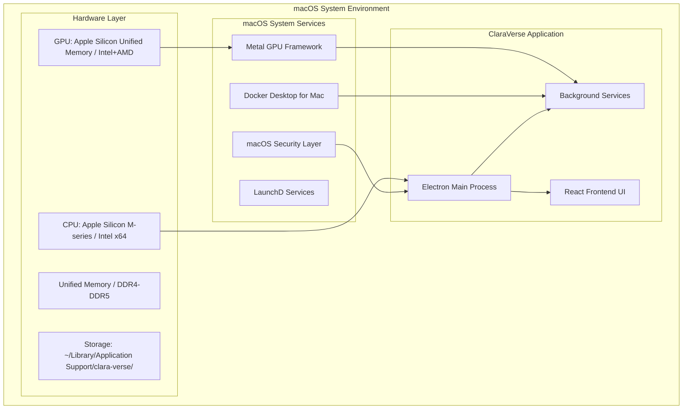
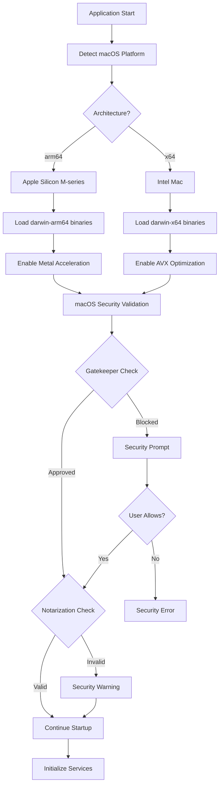
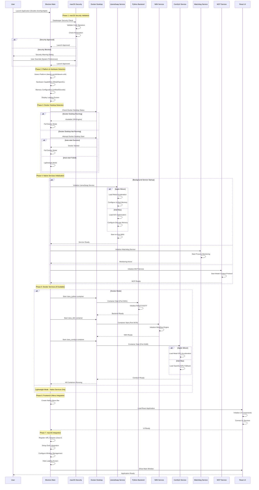
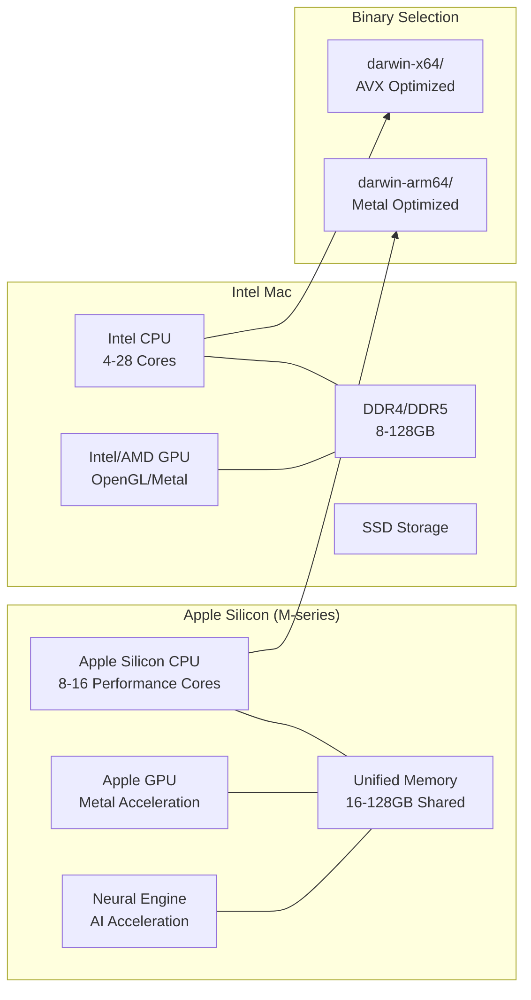
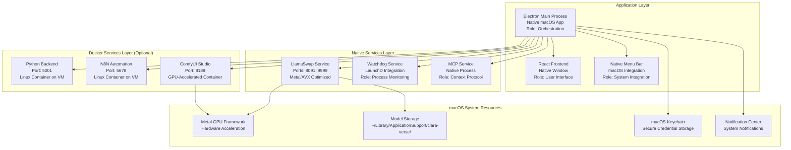
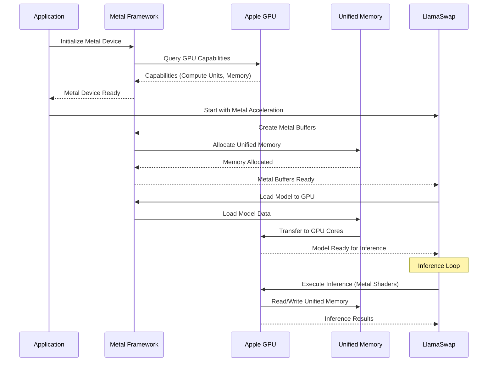
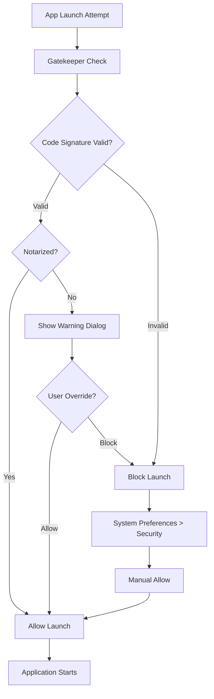
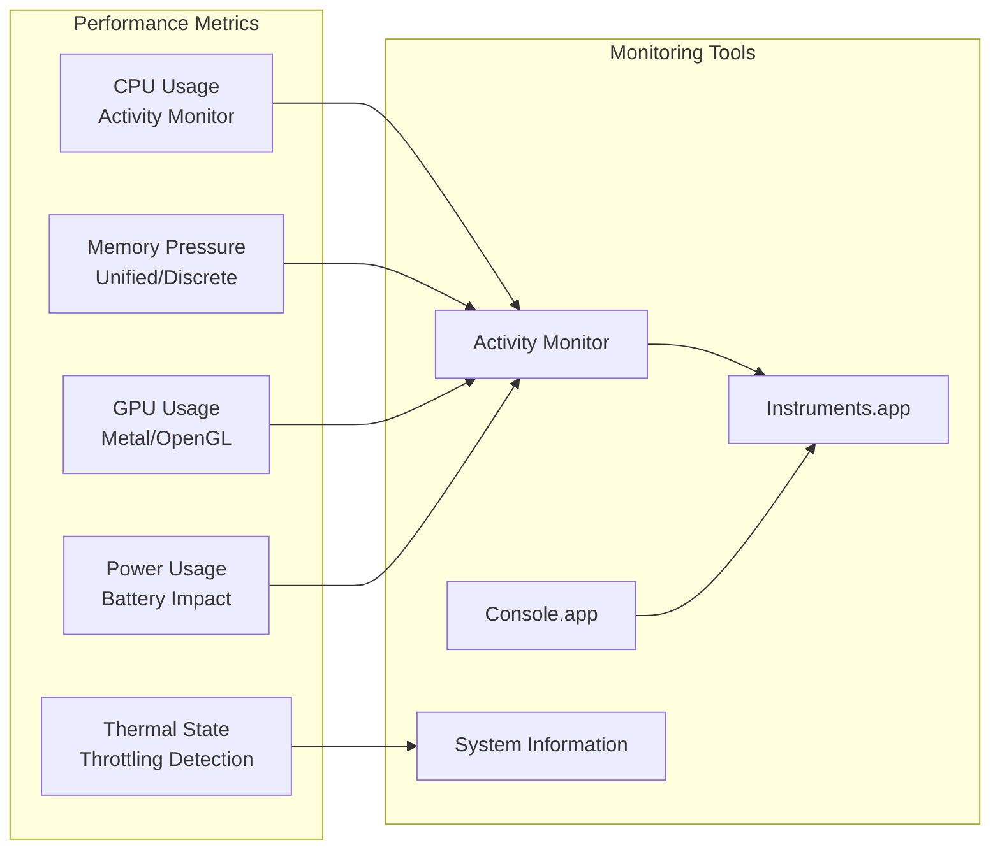

# ClaraVerse macOS Platform Startup Flow

## Overview

ClaraVerse on macOS leverages Apple's unified architecture with optimizations for both Apple Silicon (M-series) and Intel processors. The macOS version includes specialized Metal GPU acceleration and tight integration with macOS security features.

## System Architecture



## Platform Detection & Binary Selection



## Startup Sequence Flow



## Apple Silicon vs Intel Architecture



## Service Architecture (macOS Specific)



## macOS-Specific Implementation Details

### Binary Management
- **Apple Silicon Location**: `electron/llamacpp-binaries/darwin-arm64/`
- **Intel Location**: `electron/llamacpp-binaries/darwin-x64/`
- **Key Binaries**:
  - `llama-swap-darwin`: Model swapping orchestrator
  - `llama-server`: Model inference server
  - Metal-optimized libraries for Apple Silicon
  - AVX-optimized libraries for Intel

### Code Signing & Notarization
```xml
<!-- Entitlements (assets/entitlements.mac.plist) -->
<dict>
    <key>com.apple.security.network.server</key>
    <true/>
    <key>com.apple.security.network.client</key>
    <true/>
    <key>com.apple.security.device.audio-input</key>
    <true/>
    <key>com.apple.security.device.camera</key>
    <true/>
    <key>com.apple.security.files.user-selected.read-write</key>
    <true/>
</dict>
```

### Environment Variables (macOS)
```bash
# Apple Silicon Optimizations
METAL_DEVICE_WRAPPER_TYPE=1
PYTORCH_ENABLE_MPS_FALLBACK=1

# Intel Mac Optimizations  
OMP_NUM_THREADS=8
VECLIB_MAXIMUM_THREADS=8

# Application Data Directory
CLARA_DATA_DIR=~/Library/Application\ Support/clara-verse

# Docker Desktop Integration
DOCKER_HOST=unix:///var/run/docker.sock
```

### File System Structure (macOS)
```
~/Library/Application Support/clara-verse/     # Main application data
├── llama-models/                             # Local model storage
│   ├── *.gguf                               # GGUF model files
│   └── embeddings/                          # Embedding models
├── python/                                  # Python backend data
├── n8n/                                    # N8N workflow data
├── comfyui_models/                         # ComfyUI model storage
├── comfyui_output/                         # Generated images
├── pull_timestamps.json                   # Docker pull tracking
└── lightrag_storage/                      # RAG system data

~/Library/Logs/clara-verse/                # Application logs
├── main.log                               # Main process logs
├── renderer.log                           # Frontend logs
└── services/                              # Service-specific logs
    ├── llamaswap.log
    ├── watchdog.log
    └── mcp.log

~/Library/Preferences/com.clara-ai.app.plist  # Application preferences
```

## Apple Silicon Optimizations

### Metal GPU Acceleration


### Unified Memory Architecture
- **Shared Memory Pool**: CPU and GPU share the same memory space
- **Zero-Copy Operations**: No data transfer between CPU/GPU
- **Dynamic Allocation**: Memory allocated as needed
- **Bandwidth**: 400-800 GB/s memory bandwidth

### Performance Optimizations (Apple Silicon)
```yaml
# LlamaSwap Configuration for Apple Silicon
apple_silicon_optimizations:
  metal_gpu: true
  unified_memory: true
  memory_pressure_handling: adaptive
  thread_count: performance_cores * 2
  batch_size: 512  # Higher due to unified memory
  context_length: 65536  # Larger context possible
```

## Intel Mac Optimizations

### CPU Optimizations
- **AVX2/AVX-512**: Advanced vector extensions
- **Hyper-Threading**: Logical cores utilization
- **Turbo Boost**: Dynamic frequency scaling
- **Cache Optimization**: L1/L2/L3 cache efficiency

### GPU Acceleration Options
1. **Intel Integrated Graphics**:
   - OpenGL compute shaders
   - Limited compute capability
   - Power efficient

2. **AMD Discrete Graphics**:
   - Metal compute shaders
   - Higher performance
   - External GPU support

3. **NVIDIA eGPU** (Legacy):
   - CUDA acceleration
   - Deprecated in macOS 12+

## Docker Desktop Integration

```mermaid
graph TB
    subgraph "Docker Desktop for Mac"
        VM[HyperKit Virtual Machine]
        DOCKER_ENGINE[Docker Engine (Linux)]
        VOLUME_MOUNT[Volume Mounting]
        NETWORK[Port Forwarding]
    end
    
    subgraph "macOS Host"
        CLARA[ClaraVerse App]
        HOST_FS[Host File System]
        HOST_NETWORK[Host Network]
    end
    
    subgraph "Container Services"
        PYTHON_CONTAINER[Python Backend Container]
        N8N_CONTAINER[N8N Container]
        COMFYUI_CONTAINER[ComfyUI Container]
    end
    
    CLARA --> VM
    VM --> DOCKER_ENGINE
    DOCKER_ENGINE --> PYTHON_CONTAINER
    DOCKER_ENGINE --> N8N_CONTAINER
    DOCKER_ENGINE --> COMFYUI_CONTAINER
    
    HOST_FS --> VOLUME_MOUNT
    VOLUME_MOUNT --> PYTHON_CONTAINER
    VOLUME_MOUNT --> N8N_CONTAINER
    VOLUME_MOUNT --> COMFYUI_CONTAINER
    
    HOST_NETWORK --> NETWORK
    NETWORK --> PYTHON_CONTAINER
    NETWORK --> N8N_CONTAINER
    NETWORK --> COMFYUI_CONTAINER
```

### Docker Desktop Requirements
- **Minimum**: Docker Desktop 4.0+
- **Recommended**: Docker Desktop 4.25+
- **VM Resources**:
  - CPU: 4-8 cores allocated
  - Memory: 8-16GB allocated
  - Disk: 64GB+ available

## macOS Security Integration

### Gatekeeper Integration


### Keychain Integration
```javascript
// Secure credential storage using macOS Keychain
const keychain = require('keychain');

// Store API keys securely
await keychain.setPassword({
  account: 'clara-openai-key',
  service: 'com.clara-ai.app',
  password: userApiKey
});

// Retrieve API keys
const apiKey = await keychain.getPassword({
  account: 'clara-openai-key',
  service: 'com.clara-ai.app'
});
```

## Network Configuration (macOS)

### Port Management
| Service | Internal Port | External Port | Protocol | Firewall Rule |
|---------|---------------|---------------|----------|---------------|
| React Frontend | N/A | N/A | Internal | N/A |
| Python Backend | 5000 | 5001 | HTTP | Allow Incoming |
| N8N Automation | 5678 | 5678 | HTTP | Allow Incoming |
| ComfyUI Studio | 8188 | 8188 | HTTP/WS | Allow Incoming |
| LlamaSwap Main | N/A | 8091 | HTTP | Allow Incoming |
| LlamaSwap Proxy | 9999 | 9999 | HTTP | Allow Incoming |

### Firewall Configuration
```bash
# macOS Application Firewall (GUI: System Preferences > Security & Privacy > Firewall)
# Command line configuration:
sudo /usr/libexec/ApplicationFirewall/socketfilterfw --setglobalstate on
sudo /usr/libexec/ApplicationFirewall/socketfilterfw --setallowsigned on
sudo /usr/libexec/ApplicationFirewall/socketfilterfw --add /Applications/Clara.app
sudo /usr/libexec/ApplicationFirewall/socketfilterfw --unblockapp /Applications/Clara.app
```

## Performance Monitoring



## Troubleshooting Guide (macOS)

### Common Issues

1. **Gatekeeper Blocking Launch**
   ```bash
   # Check quarantine status
   xattr -l /Applications/Clara.app
   
   # Remove quarantine (if safe)
   sudo xattr -rd com.apple.quarantine /Applications/Clara.app
   
   # Allow in System Preferences
   # System Preferences > Security & Privacy > General > Allow apps downloaded from: App Store and identified developers
   ```

2. **Docker Desktop Not Starting**
   ```bash
   # Check Docker Desktop status
   docker version
   
   # Restart Docker Desktop
   osascript -e 'quit app "Docker Desktop"'
   open -a "Docker Desktop"
   
   # Reset Docker Desktop (if needed)
   rm -rf ~/Library/Group\ Containers/group.com.docker
   ```

3. **Metal GPU Not Detected (Apple Silicon)**
   ```bash
   # Check Metal support
   system_profiler SPDisplaysDataType | grep -i metal
   
   # Check GPU usage
   sudo powermetrics -n 1 -s gpu_power
   
   # Activity Monitor > GPU tab
   ```

4. **Port Conflicts**
   ```bash
   # Check port usage
   lsof -i :5001
   lsof -i :8091
   lsof -i :8188
   
   # Kill conflicting processes
   sudo lsof -ti:5001 | xargs kill -9
   ```

5. **Model Loading Issues**
   ```bash
   # Check model directory
   ls -la ~/Library/Application\ Support/clara-verse/llama-models/
   
   # Check permissions
   chmod 644 ~/Library/Application\ Support/clara-verse/llama-models/*.gguf
   
   # Check disk space
   df -h ~/Library/Application\ Support/clara-verse/
   ```

### Log Locations (macOS)
- Application logs: `~/Library/Logs/clara-verse/`
- System logs: `Console.app` or `log show --predicate 'process == "Clara"'`
- Docker logs: `docker logs <container_name>`
- Crash reports: `~/Library/Logs/DiagnosticReports/`

### System Information Commands
```bash
# System overview
system_profiler SPSoftwareDataType SPHardwareDataType

# CPU information
sysctl -n machdep.cpu.brand_string
sysctl -n hw.ncpu
sysctl -n hw.logicalcpu

# Memory information
sysctl -n hw.memsize
vm_stat

# GPU information (Apple Silicon)
system_profiler SPDisplaysDataType

# Network information
ifconfig
netstat -rn
```

This comprehensive documentation covers the complete macOS startup flow, platform-specific optimizations, and integration with macOS system services for ClaraVerse. 