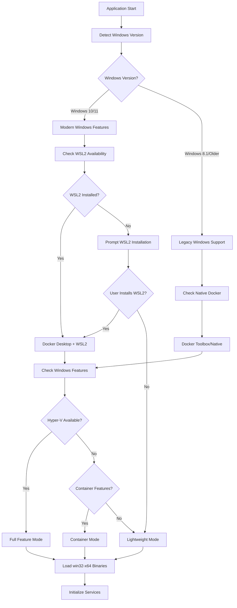
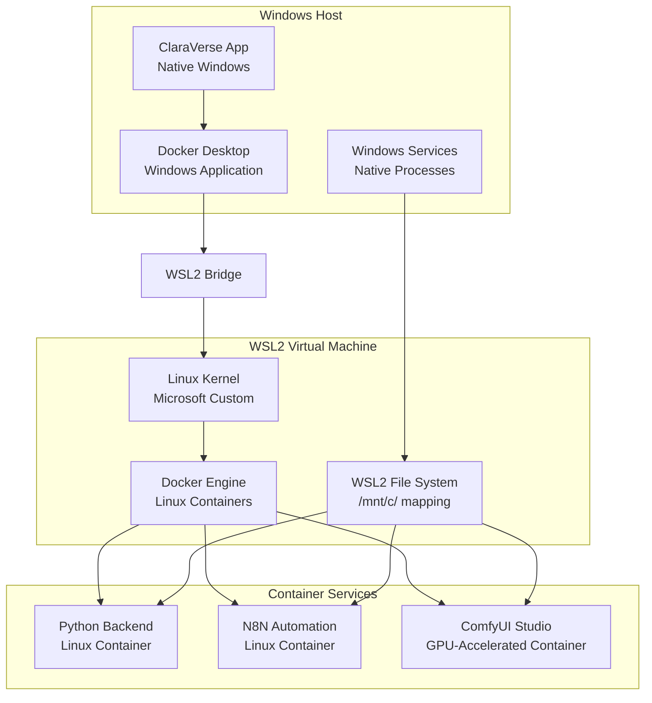
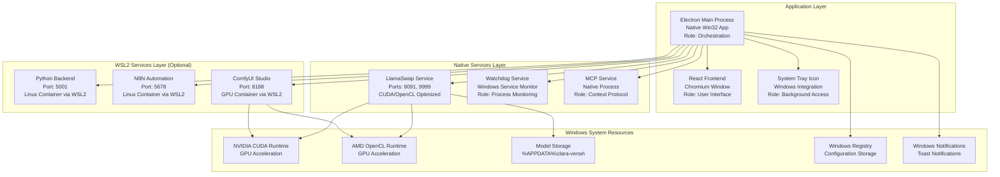
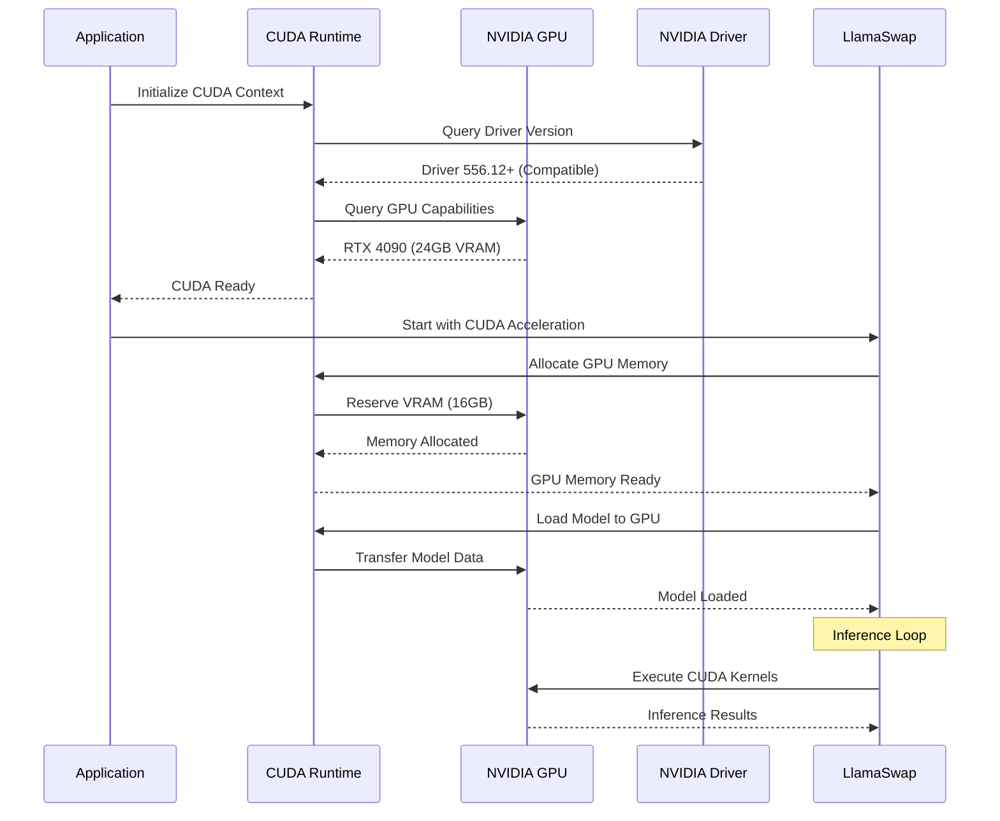
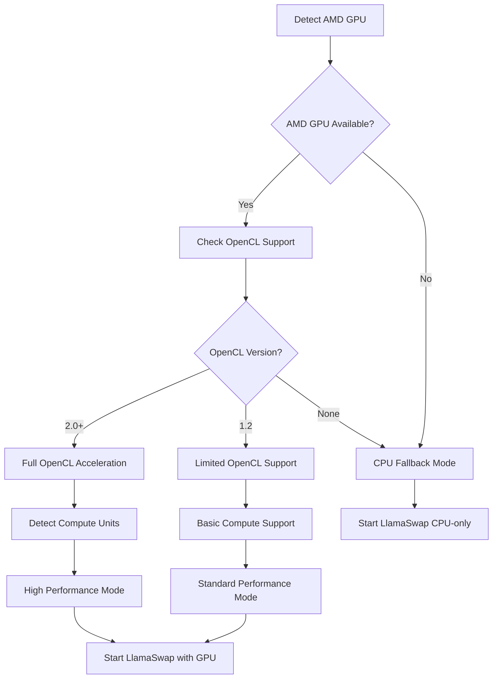
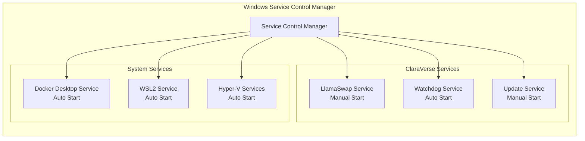
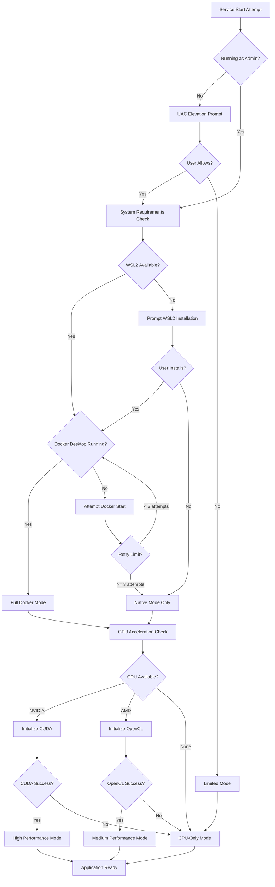
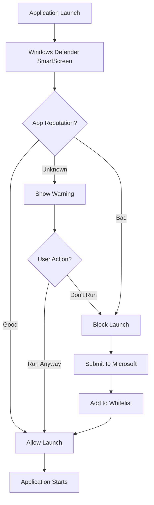

# ClaraVerse Windows Platform Startup Flow

## Overview

ClaraVerse on Windows operates through a hybrid architecture combining native Windows services with WSL2 (Windows Subsystem for Linux) for Docker containerization. The Windows version supports both traditional Win32 API integration and modern Windows features.

## System Architecture

```mermaid
graph TB
    subgraph "Windows System Environment"
        subgraph "Hardware Layer"
            CPU[CPU: Intel/AMD x64]
            GPU[GPU: NVIDIA/AMD DirectX/CUDA]
            MEM[System Memory: DDR4/DDR5]
            STORAGE[Storage: C:\Users\{User}\AppData\Roaming\clara-verse\]
        end
        
        subgraph "Windows System Services"
            WIN_SERVICES[Windows Services]
            WSL2[Windows Subsystem for Linux 2]
            DOCKER[Docker Desktop for Windows]
            REGISTRY[Windows Registry]
            SECURITY[Windows Security]
        end
        
        subgraph "ClaraVerse Application"
            ELECTRON[Electron Main Process]
            REACT[React Frontend UI]
            SERVICES[Background Services]
        end
    end
    
    CPU --> ELECTRON
    GPU --> SERVICES
    WSL2 --> DOCKER
    DOCKER --> SERVICES
    REGISTRY --> ELECTRON
    SECURITY --> ELECTRON
    ELECTRON --> REACT
    ELECTRON --> SERVICES
```

## Windows-Specific Startup Detection



## Startup Sequence Flow

```mermaid
sequenceDiagram
    participant User
    participant Electron as Electron Main
    participant Windows as Windows System
    participant WSL2 as WSL2 Subsystem
    participant Docker as Docker Desktop
    participant LlamaSwap as LlamaSwap Service
    participant PyBackend as Python Backend
    participant N8N as N8N Service
    participant ComfyUI as ComfyUI Service
    participant Watchdog as Watchdog Service
    participant MCP as MCP Service
    participant Frontend as React UI

    User->>Electron: Launch Application (.exe)
    
    Note over Windows: Phase 1: Windows Security & UAC
    Electron->>Windows: Windows Security Check
    Windows->>Windows: User Account Control (if needed)
    Windows->>Windows: Windows Defender SmartScreen
    alt Security Approved
        Windows-->>Electron: Launch Approved
    else Security Blocked
        Windows-->>User: SmartScreen Warning
        User->>Windows: User Override ("Run anyway")
        Windows-->>Electron: Launch Approved
    end
    
    Note over Electron: Phase 2: System & Hardware Detection
    Electron->>Windows: Detect Windows Version & Build
    Electron->>Windows: Check CPU Features (AVX2, SSE4.2)
    Electron->>Windows: Detect GPU (NVIDIA CUDA, AMD OpenCL)
    Electron->>Windows: Check Available Memory
    Electron->>Electron: Display Loading Screen
    
    Note over Electron: Phase 3: WSL2 & Docker Detection
    Electron->>WSL2: Check WSL2 Installation
    alt WSL2 Available
        WSL2-->>Electron: WSL2 Ready
        Electron->>Docker: Check Docker Desktop Status
        alt Docker Desktop Running
            Docker-->>Electron: Available (WSL2 Backend)
            Electron->>Electron: Full Docker Mode
        else Docker Desktop Not Running
            Electron->>Docker: Attempt Docker Desktop Start
            alt Auto-start Success
                Docker-->>Electron: Docker Started
                Electron->>Electron: Full Docker Mode
            else Auto-start Failed
                Electron->>Electron: Lightweight Mode
            end
        end
    else WSL2 Not Available
        Electron->>Windows: Check Native Docker Support
        alt Native Docker Available
            Electron->>Electron: Native Docker Mode
        else No Docker Support
            Electron->>Electron: Lightweight Mode
        end
    end
    
    Note over Electron: Phase 4: Native Services Initialization
    par Background Service Startup
        Electron->>LlamaSwap: Initialize LlamaSwap Service
        LlamaSwap->>Windows: Load Windows-specific Libraries
        alt NVIDIA GPU Detected
            LlamaSwap->>LlamaSwap: Initialize CUDA 12.6
            LlamaSwap->>LlamaSwap: Configure GPU Acceleration
        else AMD GPU Detected
            LlamaSwap->>LlamaSwap: Initialize OpenCL
        else CPU Only
            LlamaSwap->>LlamaSwap: Configure AVX2 Optimization
        end
        LlamaSwap->>LlamaSwap: Start on Port 8091
        LlamaSwap-->>Electron: Service Ready
    and
        Electron->>Watchdog: Initialize Watchdog Service
        Watchdog->>Windows: Register Windows Service Monitor
        Watchdog->>Watchdog: Start Process Monitoring
        Watchdog-->>Electron: Monitoring Active
    and
        Electron->>MCP: Initialize MCP Service
        MCP->>MCP: Start Model Context Protocol
        MCP-->>Electron: MCP Ready
    end
    
    Note over Electron: Phase 5: Docker Services (If Available)
    alt Docker Mode
        Electron->>Docker: Start clara_python container
        Docker->>WSL2: Create Linux Container
        WSL2->>PyBackend: Container Start (Port 5001)
        PyBackend->>PyBackend: Initialize RAG/TTS/STT
        PyBackend-->>Docker: Backend Ready
        
        Electron->>Docker: Start clara_n8n container
        Docker->>WSL2: Create Linux Container
        WSL2->>N8N: Container Start (Port 5678)
        N8N->>N8N: Initialize Workflow Engine
        N8N-->>Docker: N8N Ready
        
        Electron->>Docker: Start clara_comfyui container
        Docker->>WSL2: Create Linux Container
        WSL2->>ComfyUI: Container Start (Port 8188)
        alt GPU Available
            ComfyUI->>ComfyUI: Load GPU Acceleration (CUDA/OpenCL)
        else CPU Only
            ComfyUI->>ComfyUI: Load CPU Fallback
        end
        ComfyUI-->>Docker: ComfyUI Ready
        
        Docker-->>Electron: All Containers Running
    else
        Note over Electron: Lightweight Mode - Native Services Only
    end
    
    Note over Electron: Phase 6: Windows Integration
    Electron->>Windows: Register with Windows Registry
    Electron->>Windows: Setup Windows Notifications
    Electron->>Windows: Configure Taskbar Integration
    Electron->>Frontend: Load React Application
    Frontend->>Frontend: Initialize UI Components
    Frontend->>Frontend: Connect to Services
    Frontend-->>Electron: UI Ready
    
    Note over Electron: Phase 7: Final System Integration
    Electron->>Windows: Register Protocol Handler (clara://)
    Electron->>Windows: Setup System Tray Icon
    Electron->>Windows: Configure Auto-Start (if enabled)
    Electron->>Electron: Hide Loading Screen
    Electron->>Frontend: Show Main Window
    Frontend-->>User: Application Ready
```



## WSL2 Integration Architecture



## Service Architecture (Windows Specific)



## Windows-Specific Implementation Details

### Binary Management
- **Location**: `electron/llamacpp-binaries/win32-x64/`
- **Key Binaries**:
  - `llama-swap-win32-x64.exe`: Model swapping orchestrator
  - `llama-server.exe`: Model inference server
  - CUDA-enabled libraries (if NVIDIA GPU)
  - OpenCL-enabled libraries (if AMD GPU)
  - AVX2-optimized libraries for Intel/AMD CPUs

### Windows Registry Integration
```
HKEY_CURRENT_USER\Software\clara-ai\clara-verse\
├── InstallPath          : REG_SZ : C:\Users\{User}\AppData\Local\Programs\clara-verse\
├── DataPath            : REG_SZ : C:\Users\{User}\AppData\Roaming\clara-verse\
├── AutoStart           : REG_DWORD : 0x00000001
├── LastVersion         : REG_SZ : 0.1.21
├── DockerMode          : REG_SZ : WSL2
└── Services\
    ├── LlamaSwap       : REG_DWORD : 0x00000001
    ├── Python          : REG_DWORD : 0x00000001
    ├── N8N             : REG_DWORD : 0x00000001
    └── ComfyUI         : REG_DWORD : 0x00000001
```

### Environment Variables (Windows)
```cmd
REM CUDA Configuration (if NVIDIA GPU)
set CUDA_PATH=C:\Program Files\NVIDIA GPU Computing Toolkit\CUDA\v12.6
set PATH=%CUDA_PATH%\bin;%PATH%

REM OpenCL Configuration (if AMD GPU)  
set OPENCL_VENDOR_PATH=C:\Windows\System32

REM Application Data Directory
set CLARA_DATA_DIR=%APPDATA%\clara-verse

REM WSL2 Integration
set DOCKER_HOST=npipe:////./pipe/docker_engine
set WSL_DISTRO_NAME=docker-desktop

REM Performance Optimizations
set OMP_NUM_THREADS=8
set CUDA_VISIBLE_DEVICES=0
```

### File System Structure (Windows)
```
%APPDATA%\clara-verse\                    # Main application data
├── llama-models\                         # Local model storage
│   ├── *.gguf                           # GGUF model files
│   └── embeddings\                      # Embedding models
├── python\                              # Python backend data
├── n8n\                                # N8N workflow data
├── comfyui_models\                     # ComfyUI model storage
├── comfyui_output\                     # Generated images
├── pull_timestamps.json               # Docker pull tracking
└── lightrag_storage\                  # RAG system data

%APPDATA%\clara-verse\logs\             # Application logs
├── main.log                           # Main process logs
├── renderer.log                       # Frontend logs
└── services\                          # Service-specific logs
    ├── llamaswap.log
    ├── watchdog.log
    └── mcp.log

%LOCALAPPDATA%\Programs\clara-verse\    # Application installation
├── clara-verse.exe                    # Main executable
├── electron\                          # Electron binaries
├── resources\                         # Application resources
└── locales\                          # Internationalization
```

## GPU Acceleration Support

### NVIDIA CUDA Implementation


### AMD GPU Support


## Windows Services Integration

### Service Registration & Management


### PowerShell Integration
```powershell
# ClaraVerse PowerShell Management Module

# Check system requirements
function Test-ClaraVerseRequirements {
    $requirements = @{
        'Windows Version' = (Get-WmiObject -Class Win32_OperatingSystem).Version
        'WSL2 Available' = (Get-WindowsOptionalFeature -Online -FeatureName Microsoft-Windows-Subsystem-Linux).State
        'Hyper-V Available' = (Get-WindowsOptionalFeature -Online -FeatureName Microsoft-Hyper-V-All).State
        'Docker Desktop' = Test-Path 'C:\Program Files\Docker\Docker\Docker Desktop.exe'
        'NVIDIA GPU' = (Get-WmiObject -Class Win32_VideoController | Where-Object {$_.Name -like '*NVIDIA*'}) -ne $null
        'AMD GPU' = (Get-WmiObject -Class Win32_VideoController | Where-Object {$_.Name -like '*AMD*' -or $_.Name -like '*Radeon*'}) -ne $null
    }
    return $requirements
}

# Manage ClaraVerse services
function Start-ClaraVerseServices {
    Start-Service -Name "clara-llamaswap" -ErrorAction SilentlyContinue
    Start-Service -Name "clara-watchdog" -ErrorAction SilentlyContinue
    Write-Host "ClaraVerse services started"
}

function Stop-ClaraVerseServices {
    Stop-Service -Name "clara-llamaswap" -Force -ErrorAction SilentlyContinue
    Stop-Service -Name "clara-watchdog" -Force -ErrorAction SilentlyContinue
    Write-Host "ClaraVerse services stopped"
}
```

## Windows Performance Optimizations

### CPU Optimizations
- **AVX2 Support**: Advanced Vector Extensions 2.0
- **SSE4.2 Support**: Streaming SIMD Extensions 4.2
- **Multi-threading**: Windows Thread Pool API
- **NUMA Awareness**: Non-Uniform Memory Access optimization
- **Process Priority**: High priority for inference processes

### Memory Management
```cpp
// Windows-specific memory optimizations
#include <windows.h>
#include <memoryapi.h>

// Large page support for better performance
BOOL EnableLargePages() {
    HANDLE token;
    if (!OpenProcessToken(GetCurrentProcess(), 
                         TOKEN_ADJUST_PRIVILEGES | TOKEN_QUERY, 
                         &token)) {
        return FALSE;
    }
    
    // Enable SeLockMemoryPrivilege
    LUID luid;
    if (!LookupPrivilegeValue(NULL, SE_LOCK_MEMORY_NAME, &luid)) {
        CloseHandle(token);
        return FALSE;
    }
    
    TOKEN_PRIVILEGES tp;
    tp.PrivilegeCount = 1;
    tp.Privileges[0].Luid = luid;
    tp.Privileges[0].Attributes = SE_PRIVILEGE_ENABLED;
    
    BOOL result = AdjustTokenPrivileges(token, FALSE, &tp, 0, NULL, NULL);
    CloseHandle(token);
    return result && (GetLastError() == ERROR_SUCCESS);
}
```

### GPU Memory Management
```yaml
# NVIDIA GPU Configuration
nvidia_optimizations:
  cuda_version: "12.6"
  driver_version: "556.12+"
  vram_allocation: "16GB"  # For RTX 4090
  memory_pool: "persistent"
  compute_capability: "8.9"
  
# AMD GPU Configuration  
amd_optimizations:
  opencl_version: "2.0"
  compute_units: "64"  # For RX 7900 XTX
  memory_allocation: "adaptive"
  workgroup_size: "256"
```

## Error Handling & Recovery (Windows)



## Network Configuration (Windows)

### Windows Firewall Integration
```powershell
# Windows Firewall Rules for ClaraVerse
New-NetFirewallRule -DisplayName "ClaraVerse - Python Backend" -Direction Inbound -Port 5001 -Protocol TCP -Action Allow
New-NetFirewallRule -DisplayName "ClaraVerse - N8N Automation" -Direction Inbound -Port 5678 -Protocol TCP -Action Allow
New-NetFirewallRule -DisplayName "ClaraVerse - ComfyUI Studio" -Direction Inbound -Port 8188 -Protocol TCP -Action Allow
New-NetFirewallRule -DisplayName "ClaraVerse - LlamaSwap Main" -Direction Inbound -Port 8091 -Protocol TCP -Action Allow
New-NetFirewallRule -DisplayName "ClaraVerse - LlamaSwap Proxy" -Direction Inbound -Port 9999 -Protocol TCP -Action Allow

# Allow ClaraVerse application through firewall
New-NetFirewallRule -DisplayName "ClaraVerse Application" -Direction Inbound -Program "C:\Users\{User}\AppData\Local\Programs\clara-verse\clara-verse.exe" -Action Allow
```

### Port Management
| Service | Internal Port | External Port | Protocol | Windows Firewall Rule |
|---------|---------------|---------------|----------|----------------------|
| React Frontend | N/A | N/A | Internal | N/A |
| Python Backend | 5000 | 5001 | HTTP | ClaraVerse - Python Backend |
| N8N Automation | 5678 | 5678 | HTTP | ClaraVerse - N8N Automation |
| ComfyUI Studio | 8188 | 8188 | HTTP/WS | ClaraVerse - ComfyUI Studio |
| LlamaSwap Main | N/A | 8091 | HTTP | ClaraVerse - LlamaSwap Main |
| LlamaSwap Proxy | 9999 | 9999 | HTTP | ClaraVerse - LlamaSwap Proxy |

### WSL2 Networking
```yaml
# WSL2 Network Configuration
wsl2_networking:
  backend: "HyperV"
  virtual_switch: "WSL"
  ip_range: "172.16.0.0/12"
  dns_server: "8.8.8.8"
  port_forwarding:
    - host_port: 5001
      container_port: 5000
      protocol: "tcp"
    - host_port: 5678
      container_port: 5678
      protocol: "tcp"
    - host_port: 8188
      container_port: 8188
      protocol: "tcp"
```

## Troubleshooting Guide (Windows)

### Common Issues

1. **UAC/Admin Rights Issues**
   ```cmd
   REM Check if running as administrator
   net session >nul 2>&1
   if %errorLevel% == 0 (
       echo Running as Administrator
   ) else (
       echo Not running as Administrator
       echo Right-click and select "Run as administrator"
   )
   ```

2. **WSL2 Not Installed**
   ```powershell
   # Check WSL2 installation
   wsl --list --verbose
   
   # Install WSL2 (requires restart)
   wsl --install
   
   # Enable WSL2 feature
   Enable-WindowsOptionalFeature -Online -FeatureName Microsoft-Windows-Subsystem-Linux
   Enable-WindowsOptionalFeature -Online -FeatureName VirtualMachinePlatform
   ```

3. **Docker Desktop Issues**
   ```cmd
   REM Check Docker status
   docker version
   
   REM Restart Docker Desktop
   taskkill /F /IM "Docker Desktop.exe"
   start "" "C:\Program Files\Docker\Docker\Docker Desktop.exe"
   
   REM Reset Docker (if needed)
   "C:\Program Files\Docker\Docker\Docker Desktop.exe" --factory-reset
   ```

4. **CUDA Not Detected**
   ```cmd
   REM Check NVIDIA drivers
   nvidia-smi
   
   REM Check CUDA installation
   nvcc --version
   
   REM Verify CUDA path
   echo %CUDA_PATH%
   
   REM Test CUDA sample
   cd "%CUDA_PATH%\extras\demo_suite"
   deviceQuery.exe
   ```

5. **Port Conflicts**
   ```cmd
   REM Check port usage
   netstat -ano | findstr :5001
   netstat -ano | findstr :8091
   netstat -ano | findstr :8188
   
   REM Kill conflicting processes
   taskkill /PID <PID> /F
   ```

6. **Windows Defender/Antivirus Issues**
   ```powershell
   # Add ClaraVerse to Windows Defender exclusions
   Add-MpPreference -ExclusionPath "C:\Users\$env:USERNAME\AppData\Local\Programs\clara-verse\"
   Add-MpPreference -ExclusionPath "C:\Users\$env:USERNAME\AppData\Roaming\clara-verse\"
   Add-MpPreference -ExclusionProcess "clara-verse.exe"
   Add-MpPreference -ExclusionProcess "llama-swap-win32-x64.exe"
   Add-MpPreference -ExclusionProcess "llama-server.exe"
   ```

### Log Locations (Windows)
- Application logs: `%APPDATA%\clara-verse\logs\`
- Windows Event Logs: `Event Viewer > Application and Services Logs`
- Docker logs: `docker logs <container_name>`
- WSL2 logs: `Get-WinEvent -LogName Microsoft-Windows-Subsystem-Linux/Operational`

### System Information Commands
```cmd
REM System overview
systeminfo

REM CPU information
wmic cpu get name,numberofcores,numberoflogicalprocessors

REM Memory information
wmic computersystem get TotalPhysicalMemory

REM GPU information
wmic path win32_VideoController get name,adapterram

REM Network information
ipconfig /all
netstat -rn

REM Windows version
ver
```

### Performance Monitoring
```powershell
# Monitor ClaraVerse performance
Get-Counter -Counter "\Process(clara-verse)\% Processor Time"
Get-Counter -Counter "\Process(clara-verse)\Working Set"
Get-Counter -Counter "\GPU Engine(*)\Utilization Percentage"

# Monitor Docker/WSL2 performance
Get-Counter -Counter "\Process(docker desktop)\% Processor Time"
Get-Counter -Counter "\Process(wsl*)\% Processor Time"
```

## Windows Security Integration

### Windows Defender SmartScreen


### Code Signing Integration
```yaml
# Windows Code Signing Configuration
code_signing:
  certificate_type: "Extended Validation"
  certificate_authority: "DigiCert"
  timestamp_server: "http://timestamp.digicert.com"
  signature_algorithm: "SHA256"
  
# SmartScreen Reputation
smartscreen:
  file_reputation: "building"  # Improves over time with downloads
  publisher_reputation: "good"
  digital_signature: "valid"
```

This comprehensive documentation covers the complete Windows startup flow, WSL2 integration, GPU acceleration, and Windows-specific optimizations for ClaraVerse. 