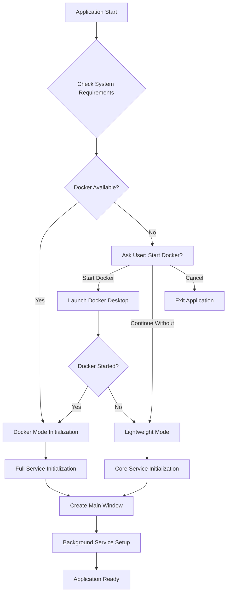
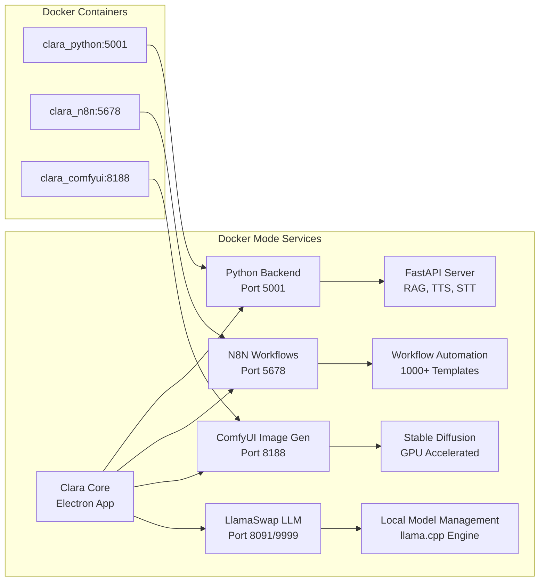
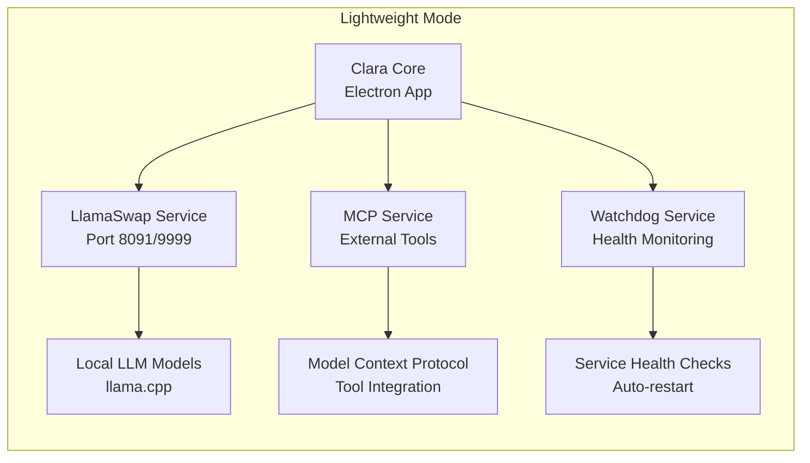
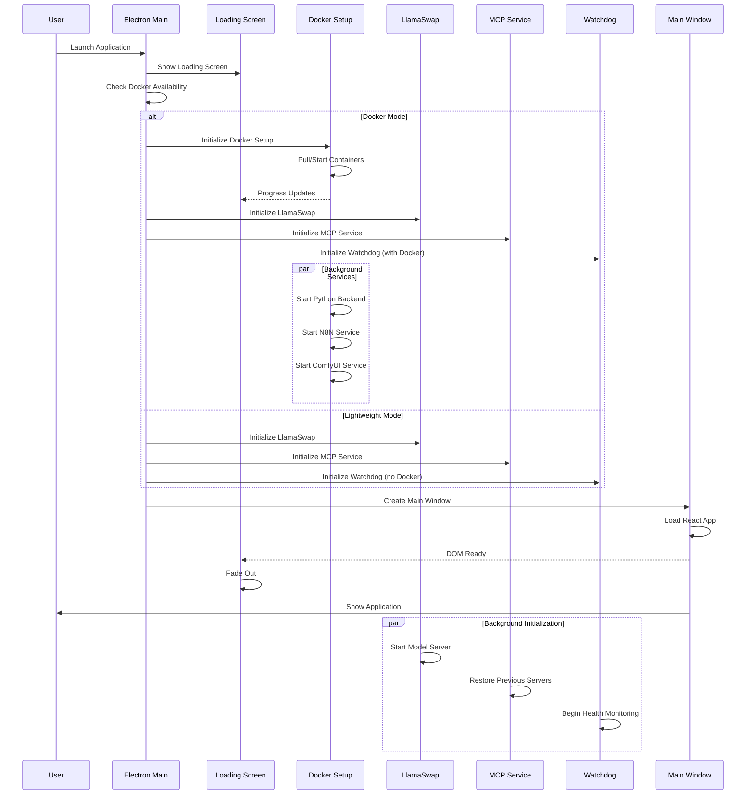
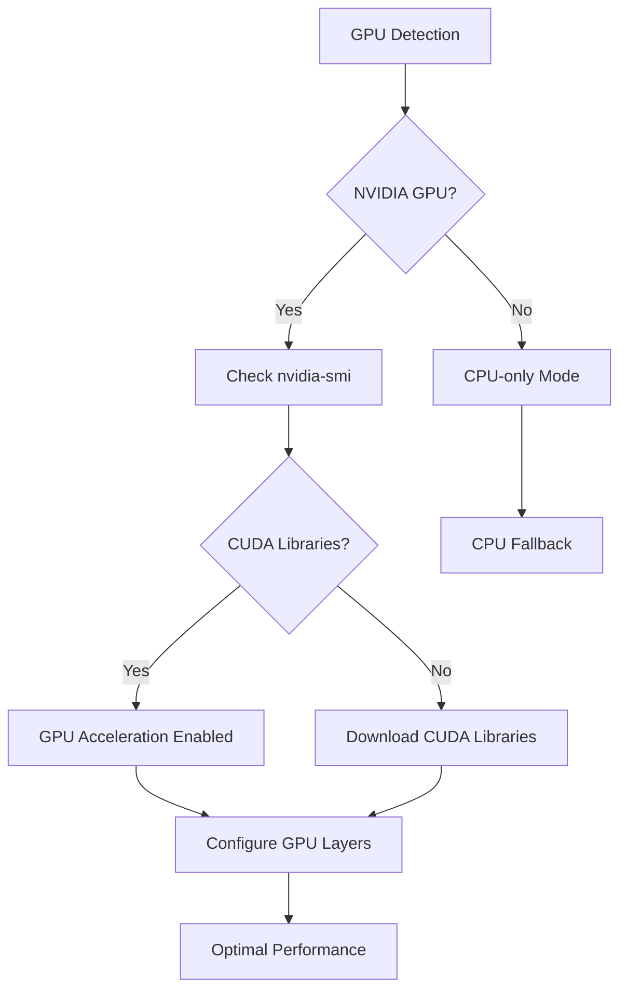
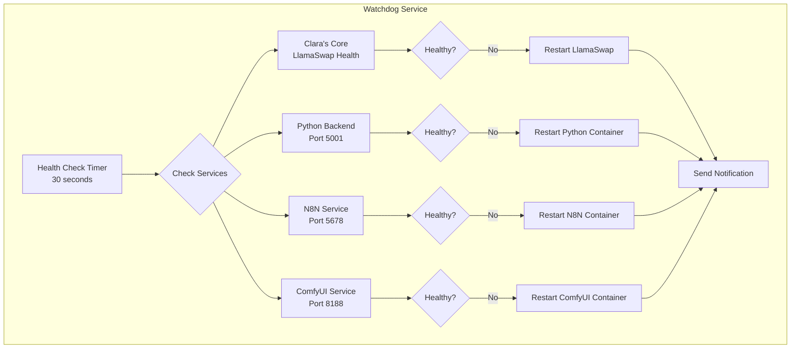
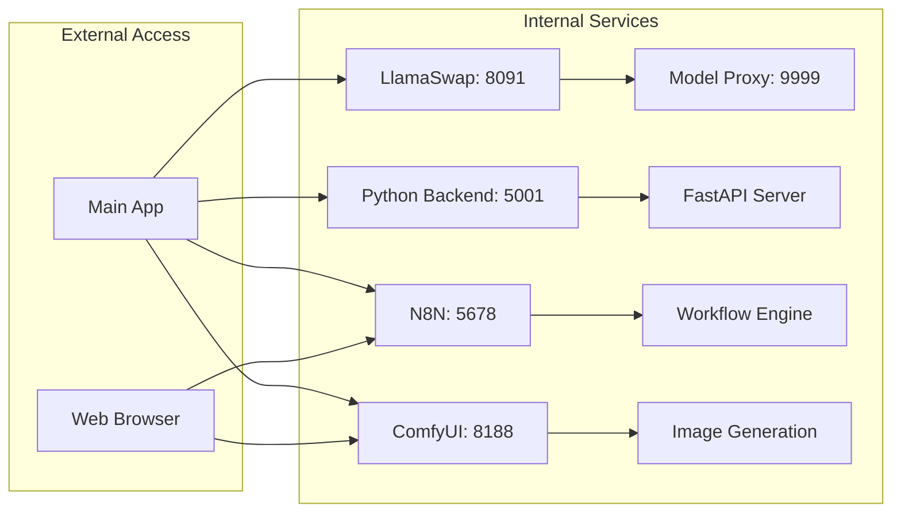
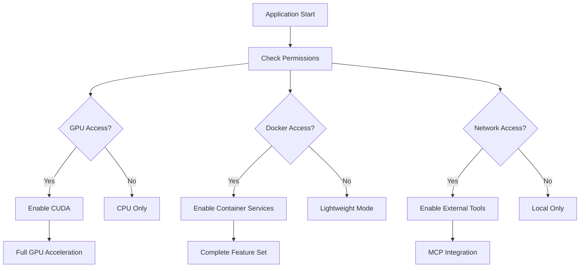
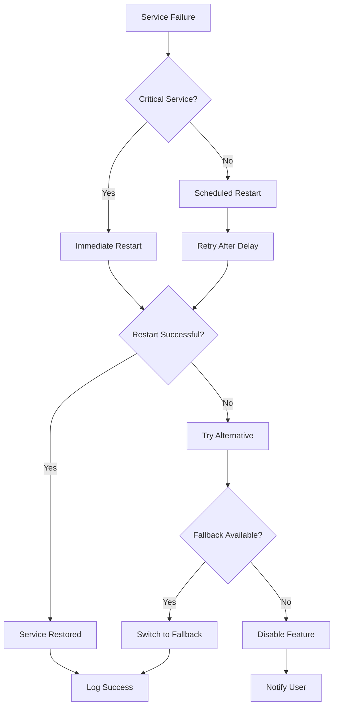

# ClaraVerse Linux Platform Startup Flow

## Overview
ClaraVerse on Linux runs as an Electron desktop application with multiple backend services. The application can operate in two modes: **Docker Mode** (full features) or **Lightweight Mode** (core features only).

## Architecture Components

### Core Components
- **Electron Main Process** (`main.cjs`) - Desktop application container
- **React Frontend** (`src/App.tsx`) - User interface (TypeScript/React)
- **LlamaSwap Service** - Local LLM model management using llama.cpp
- **Python Backend** (`py_backend/main.py`) - RAG, TTS, STT services
- **Docker Services** - Containerized AI services (optional)
- **MCP Service** - Model Context Protocol for external tools
- **Watchdog Service** - System monitoring and health checks

### Platform-Specific Binaries
- **llama.cpp binaries** in `electron/llamacpp-binaries/linux-x64/`
- **GPU Support**: CUDA 12.6 libraries for NVIDIA acceleration
- **Dynamic Libraries**: `.so` files for optimized CPU/GPU execution

## Application Startup Flow



## Docker Mode Services



## Lightweight Mode Services



## Detailed Service Startup Sequence



## Linux-Specific Configuration

### Binary Management
```yaml
Platform: linux-x64
Binaries:
  - llama-swap-linux (8.6MB)
  - llama-server (4.8MB)
  - llama-cli (2.2MB)
  
Libraries:
  - libggml.so (53KB)
  - libllama.so (2.0MB)
  - libggml-cpu*.so (various CPU optimizations)
  - libggml-vulkan.so (27MB GPU acceleration)

Environment:
  LD_LIBRARY_PATH: /path/to/llamacpp-binaries/linux-x64
  CUDA_VISIBLE_DEVICES: 0 (if GPU available)
```

### GPU Acceleration


## Service Health Monitoring



## File System Structure

```
~/.clara/                          # User data directory
├── llama-models/                  # Local LLM models
│   ├── *.gguf files              # Quantized models
│   └── config.yaml               # Model configuration
├── comfyui_models/               # ComfyUI models
├── comfyui_output/               # Generated images
├── n8n/                          # N8N workflow data
├── lightrag_storage/             # RAG database
├── pull_timestamps.json         # Docker update tracking
└── settings.json                # Application settings

/tmp/clara-electron-*             # Temporary files
/usr/local/cuda-12.6/            # CUDA libraries (if GPU)
```

## Networking & Ports



## Security & Permissions



## Error Handling & Recovery



## Performance Optimization

### CPU Optimization
- **Architecture Detection**: Automatic selection of optimized binaries
- **Thread Management**: Configurable thread count based on CPU cores
- **Memory Management**: Smart allocation and garbage collection

### GPU Optimization (NVIDIA)
- **Layer Offloading**: Automatic GPU layer calculation
- **Memory Management**: VRAM usage optimization
- **Batch Processing**: Optimized batch sizes for throughput

### Storage Optimization
- **Model Caching**: Intelligent model loading/unloading
- **Temporary Cleanup**: Automatic cleanup of temporary files
- **Database Optimization**: Efficient RAG storage and retrieval

## Troubleshooting Common Issues

### GPU Not Detected
1. Check NVIDIA drivers: `nvidia-smi`
2. Verify CUDA installation: `/usr/local/cuda-12.6/`
3. Check library paths in config.yaml

### Docker Services Failing
1. Check Docker daemon: `systemctl status docker`
2. Verify container status: `docker ps -a`
3. Check port conflicts: `netstat -tulpn`

### LlamaSwap Not Starting
1. Check binary permissions: `chmod +x llama-swap-linux`
2. Verify model paths: `~/.clara/llama-models/`
3. Review logs: `~/.clara/llama-swap.log`

## Summary

ClaraVerse on Linux provides a comprehensive AI development environment with intelligent service management, automatic fallbacks, and optimized performance. The dual-mode architecture ensures both maximum functionality (Docker mode) and reliable operation (lightweight mode) based on system capabilities. 