# ClaraVerse macOS Platform Startup Flow

## Overview
ClaraVerse on macOS runs as a native Electron desktop application with full Apple Silicon and Intel support. The application provides enhanced integration with macOS security, permissions, and performance features.

## Architecture Components

### Core Components
- **Electron Main Process** (`main.cjs`) - Native macOS desktop container
- **React Frontend** (`src/App.tsx`) - User interface with macOS styling
- **LlamaSwap Service** - Optimized llama.cpp for Apple Silicon/Intel
- **Python Backend** (`py_backend/main.py`) - RAG, TTS, STT services
- **Docker Services** - Containerized AI services (Docker Desktop required)
- **MCP Service** - Model Context Protocol for external tools
- **Watchdog Service** - System monitoring with macOS integration

### Platform-Specific Features
- **Apple Silicon Optimization** - Native ARM64 binaries with Metal acceleration
- **Intel Compatibility** - x64 binaries with AVX optimization
- **Security Integration** - Notarization, hardened runtime, entitlements
- **GPU Acceleration** - Metal Performance Shaders for Apple Silicon

## Application Startup Flow

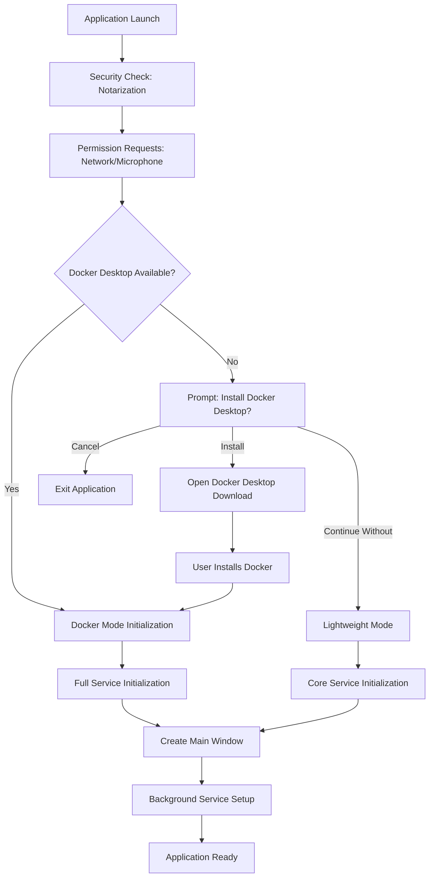

## macOS Security & Permissions

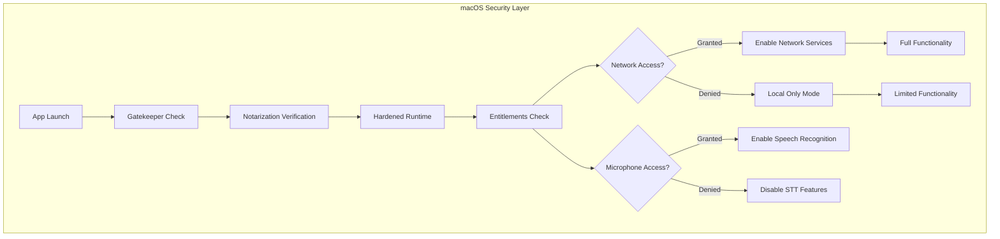

## Apple Silicon vs Intel Architecture

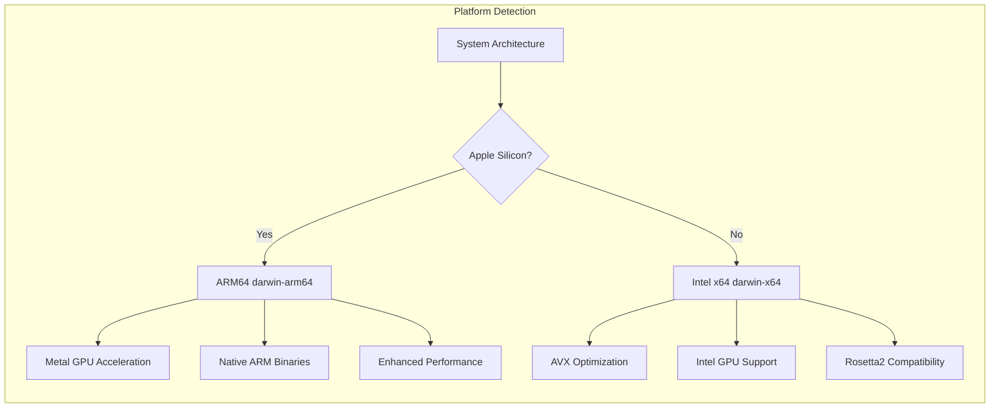

## Docker Mode Services (macOS)

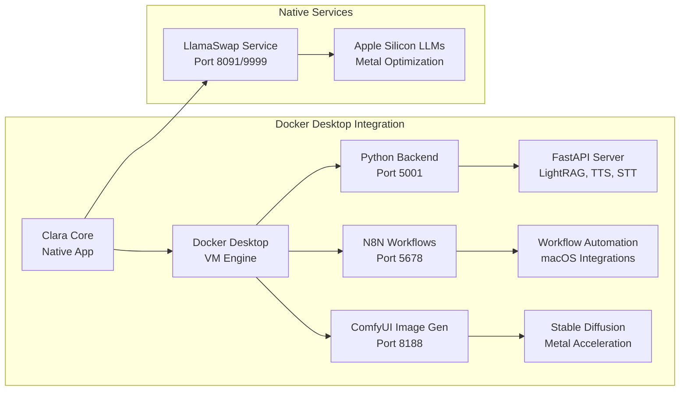

## Lightweight Mode Services (macOS)

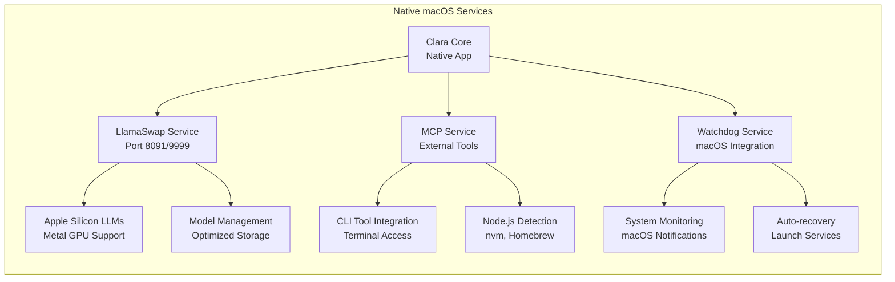

## Detailed Startup Sequence (macOS)

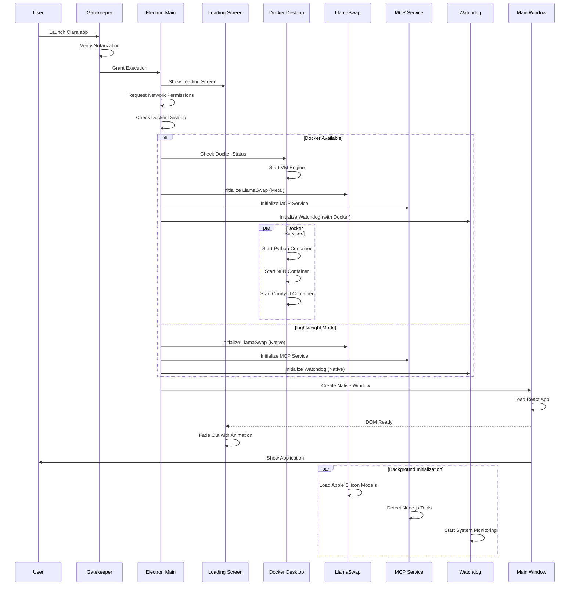

## macOS-Specific Binary Management

### Apple Silicon (ARM64)
```yaml
Platform: darwin-arm64
Binaries:
  - llama-swap-darwin-arm64 (Optimized for M1/M2/M3)
  - llama-server (Metal acceleration)
  - llama-cli (Native ARM performance)

Libraries:
  - *.dylib (Dynamic libraries)
  - *.metal (Metal shaders)
  - *.h (Headers for compilation)

Metal Support:
  - GPU Acceleration via Metal Performance Shaders
  - Unified Memory Architecture optimization
  - Low-power inference modes

Environment:
  DYLD_LIBRARY_PATH: /path/to/llamacpp-binaries/darwin-arm64
  METAL_DEVICE_WRAPPER_TYPE: 1
```

### Intel x64 (Legacy)
```yaml
Platform: darwin-x64
Binaries:
  - llama-swap-darwin-x64 (Intel optimization)
  - llama-server (AVX/AVX2 support)
  - llama-cli (x64 performance)

Libraries:
  - *.dylib (Intel dynamic libraries)
  - OpenCL support for discrete GPUs

Environment:
  DYLD_LIBRARY_PATH: /path/to/llamacpp-binaries/darwin-x64
  OMP_NUM_THREADS: auto (based on CPU cores)
```

## GPU Acceleration (Apple Silicon)

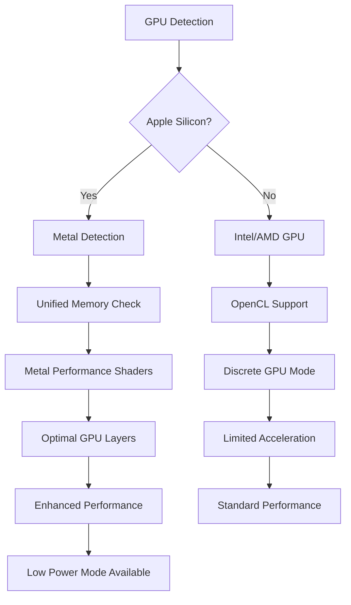

## Service Health Monitoring (macOS)

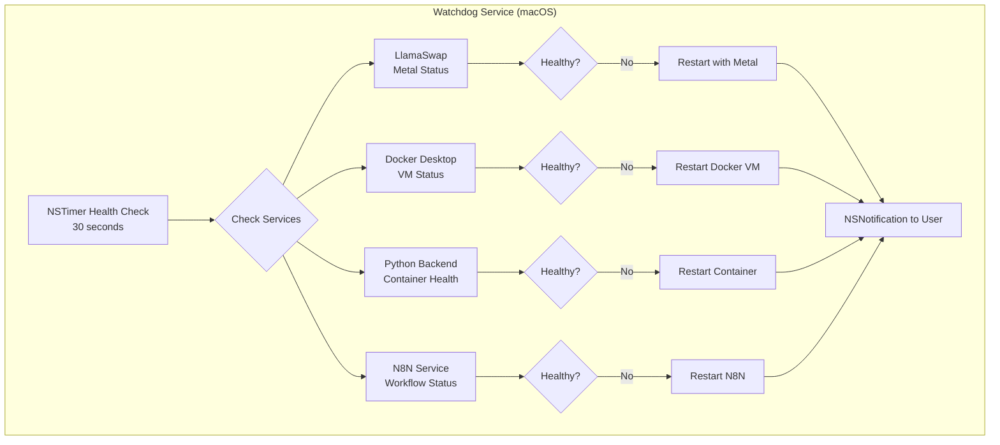

## File System Structure (macOS)

```
~/Library/Application Support/Clara/   # Application data
├── llama-models/                      # Local LLM models
│   ├── *.gguf files                  # Quantized models
│   └── config.yaml                   # Model configuration
├── comfyui_models/                   # ComfyUI models
├── comfyui_output/                   # Generated images
├── n8n/                              # N8N workflow data
├── lightrag_storage/                 # RAG database
└── settings.json                     # Application settings

~/Downloads/                          # Model downloads
/Applications/Docker.app              # Docker Desktop
/tmp/clara-electron-*                 # Temporary files
```

## Docker Desktop Integration

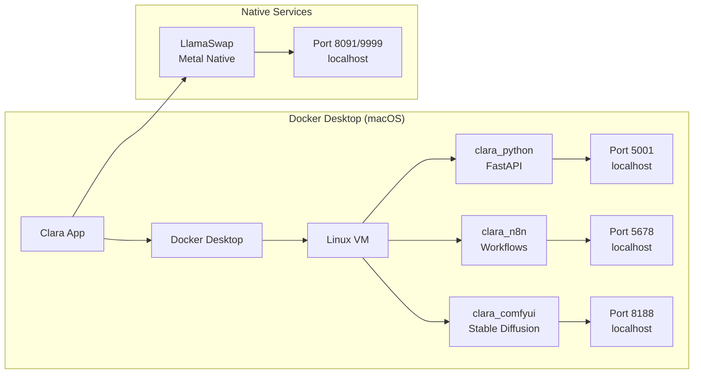

## Networking & Security (macOS)

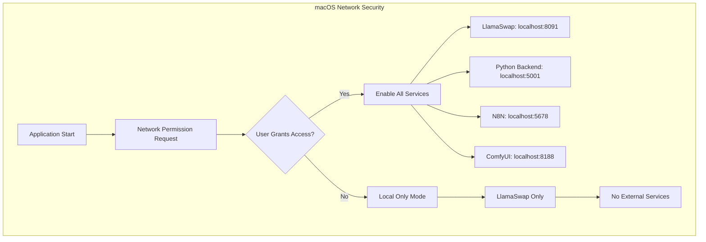

## App Store & Notarization

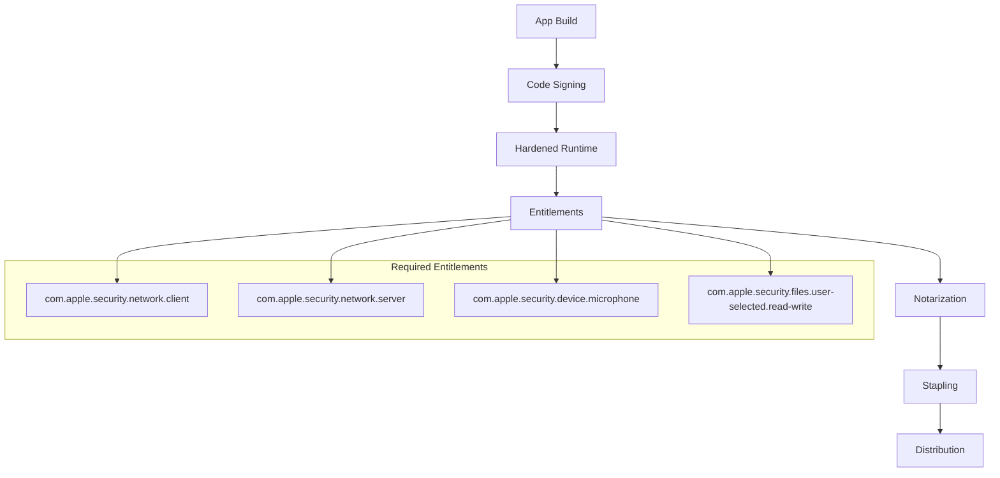

## Performance Optimization (Apple Silicon)

### Memory Management
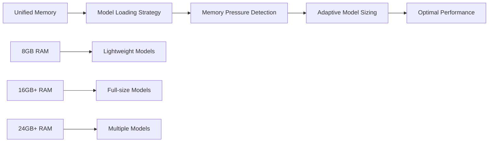

### Power Management
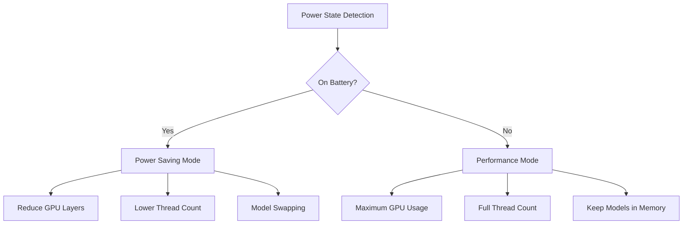

## Troubleshooting (macOS)

### Common Issues

#### Docker Desktop Not Starting
1. Check macOS version compatibility (Big Sur 11.0+)
2. Verify virtualization framework access
3. Reset Docker Desktop to factory defaults
4. Check available disk space (minimum 4GB)

#### LlamaSwap Metal Issues
1. Verify Metal support: `system_profiler SPDisplaysDataType`
2. Check for Metal framework updates
3. Reset GPU preferences in Energy Saver settings
4. Update to latest macOS version

#### Permission Denied Errors
1. Open System Settings → Privacy & Security
2. Grant network access to Clara
3. Allow microphone access for STT features
4. Add Clara to Full Disk Access if needed

#### Node.js/MCP Detection Issues
1. Check PATH in Terminal: `echo $PATH`
2. Verify Node.js installation: `node --version`
3. Check nvm configuration: `nvm list`
4. Restart Terminal and retry

## Auto-Updates (macOS)

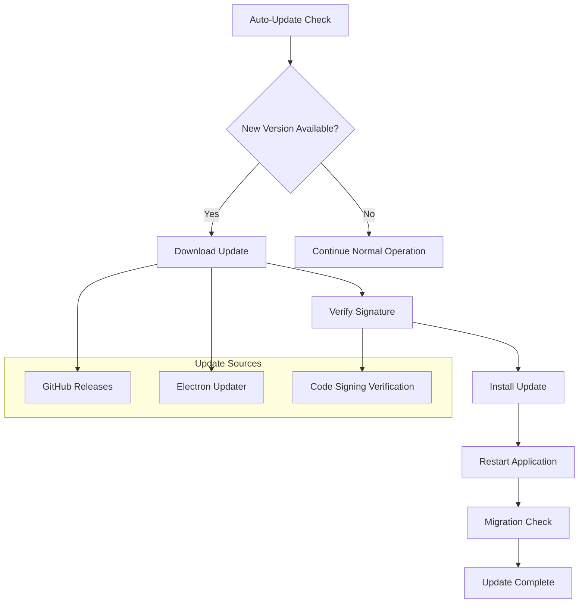

## Summary

ClaraVerse on macOS provides a premium AI development experience with:

- **Native Performance**: Optimized for both Apple Silicon and Intel Macs
- **Security Integration**: Full notarization and sandboxing support  
- **Metal Acceleration**: GPU optimization for Apple Silicon
- **Seamless Updates**: Automatic updates with code signing verification
- **Docker Integration**: Full containerized services via Docker Desktop
- **Intelligent Fallbacks**: Graceful degradation when services are unavailable

The application leverages macOS-specific features while maintaining cross-platform compatibility, ensuring optimal performance and user experience on Apple hardware. 