# ClaraVerse Windows Platform Startup Flow

## Overview
ClaraVerse on Windows runs as a native desktop application with enhanced Windows integration. The application provides comprehensive support for Windows-specific features including Docker Desktop, Windows Services, and GPU acceleration.

## Architecture Components

### Core Components
- **Electron Main Process** (`main.cjs`) - Windows desktop application container
- **React Frontend** (`src/App.tsx`) - User interface with Windows theming
- **LlamaSwap Service** - Local LLM management with Windows optimization
- **Python Backend** (`py_backend/main.py`) - RAG, TTS, STT services
- **Docker Desktop Integration** - Containerized AI services (WSL2 backend)
- **MCP Service** - Model Context Protocol for external tools
- **Watchdog Service** - System monitoring with Windows services integration

### Platform-Specific Features
- **Windows Services Integration** - Background service management
- **WSL2 Support** - Docker backend via Windows Subsystem for Linux
- **GPU Acceleration** - NVIDIA CUDA and DirectX support
- **Windows Registry Integration** - System settings and startup management
- **PowerShell Integration** - Administrative operations and service management

## Application Startup Flow

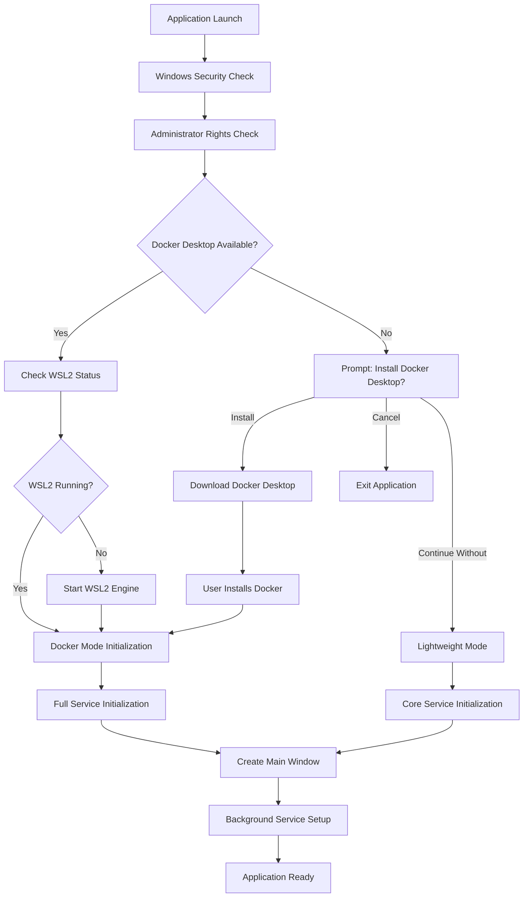

## Windows Security & Permissions

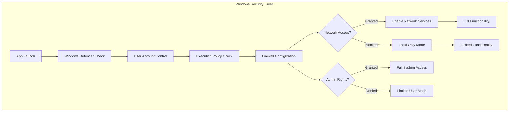

## Docker Desktop Integration (Windows)

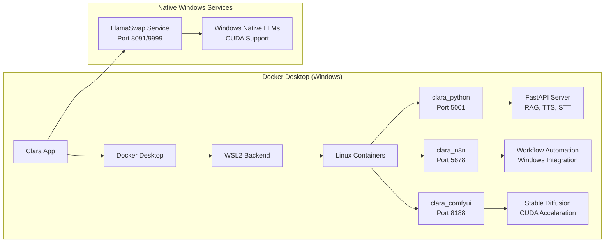

## Lightweight Mode Services (Windows)

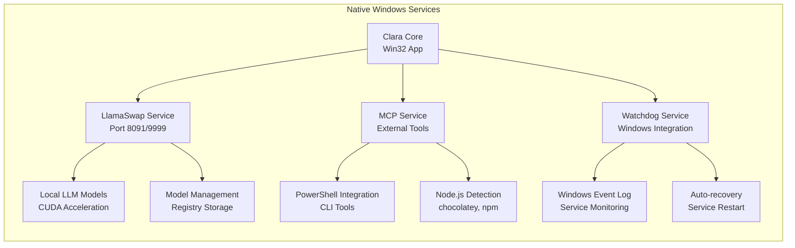

## Windows-Specific Service Management

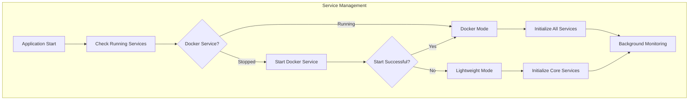

## Detailed Startup Sequence (Windows)

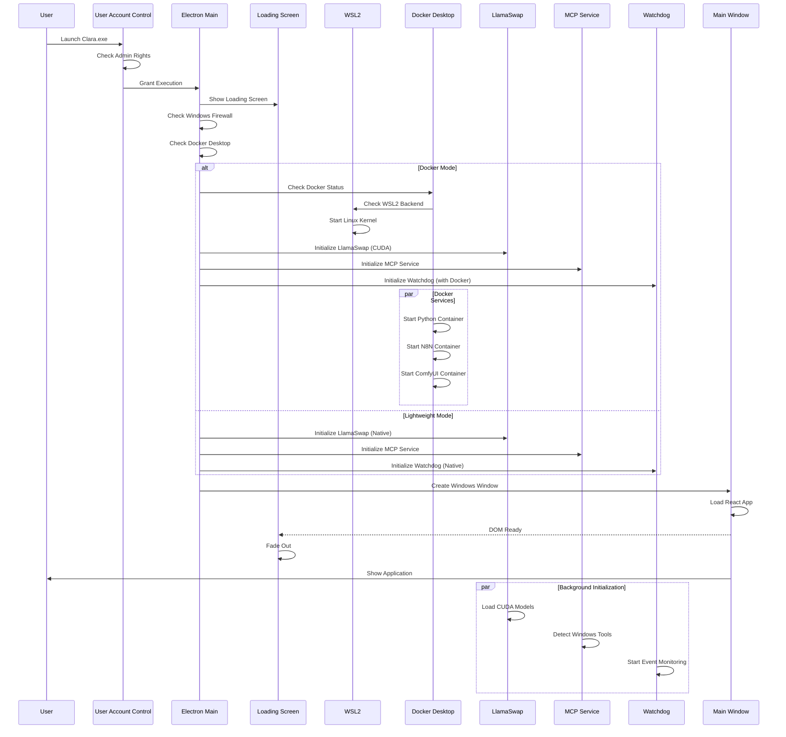

## Windows-Specific Binary Management

### Platform Configuration
```yaml
Platform: win32-x64
Binaries:
  - llama-swap-win32-x64.exe (Windows executable)
  - llama-server.exe (CUDA optimized)
  - llama-cli.exe (Console interface)

Libraries:
  - *.dll (Dynamic Link Libraries)
  - CUDA runtime libraries
  - DirectX dependencies

GPU Support:
  - NVIDIA CUDA 12.6 runtime
  - DirectX 12 acceleration
  - Windows GPU scheduling

Environment:
  PATH: %USERPROFILE%\.clara\llamacpp-binaries\win32-x64
  CUDA_PATH: C:\Program Files\NVIDIA GPU Computing Toolkit\CUDA\v12.6
```

### Registry Integration
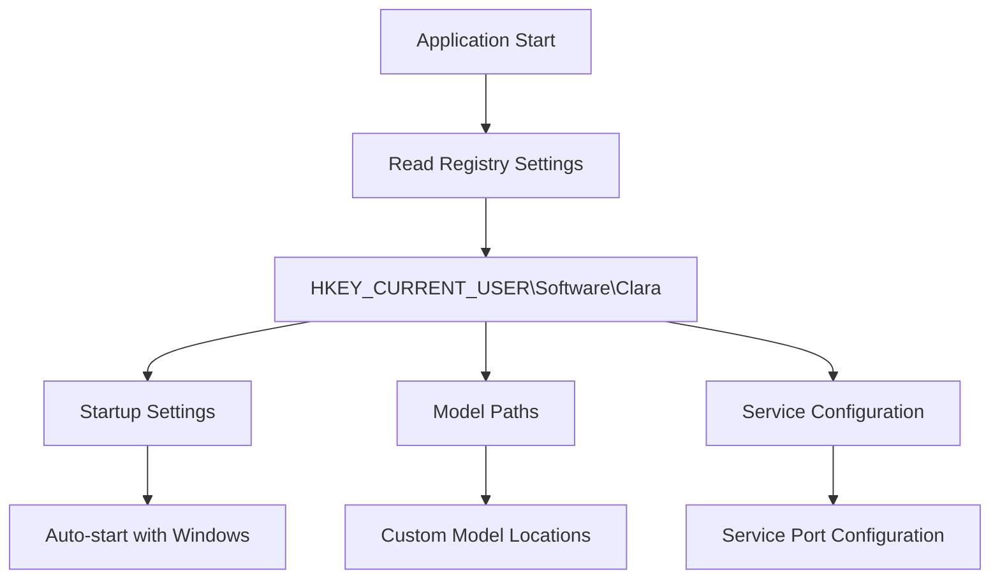

## GPU Acceleration (Windows)

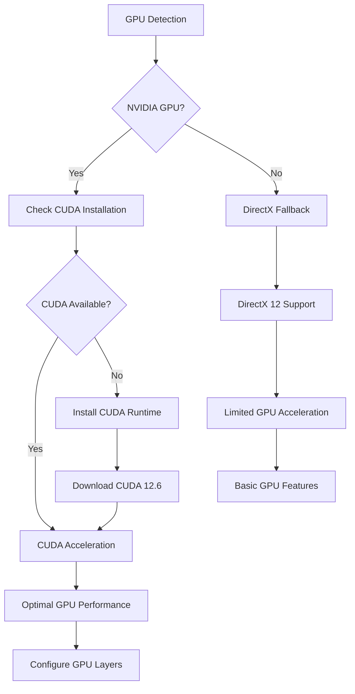

## Service Health Monitoring (Windows)

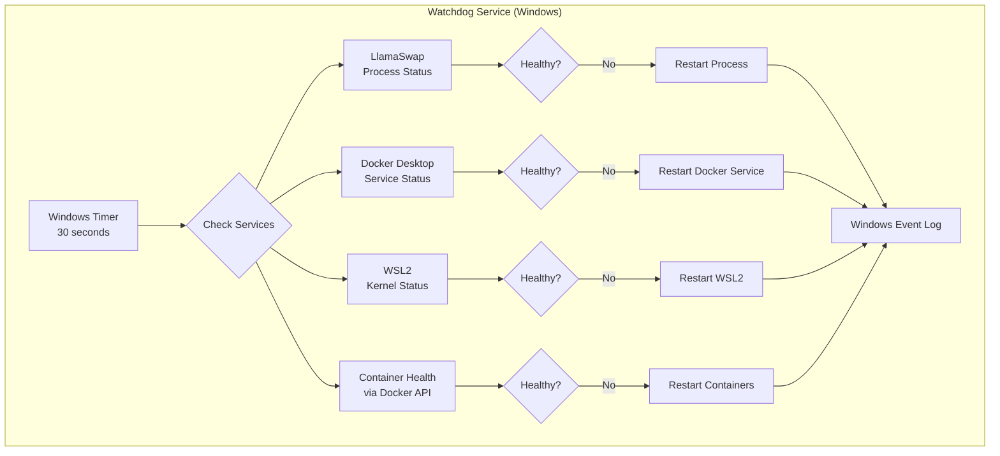

## File System Structure (Windows)

```
%USERPROFILE%\.clara\                 # User data directory
├── llama-models\                     # Local LLM models
│   ├── *.gguf files                 # Quantized models
│   └── config.yaml                  # Model configuration
├── comfyui_models\                  # ComfyUI models
├── comfyui_output\                  # Generated images
├── n8n\                             # N8N workflow data
├── lightrag_storage\                # RAG database
├── pull_timestamps.json            # Docker update tracking
└── settings.json                   # Application settings

%TEMP%\clara-electron-*              # Temporary files
%PROGRAMFILES%\NVIDIA GPU Computing Toolkit\CUDA\v12.6\  # CUDA
%PROGRAMDATA%\Docker\               # Docker Desktop data
```

## WSL2 Integration

```mermaid
graph LR
    subgraph "WSL2 Integration"
        A[Windows Host] --> B[WSL2 Kernel]
        B --> C[Linux Environment]
        
        C --> D[Docker Engine]
        D --> E[Container Runtime]
        
        E --> F[Python Backend]
        E --> G[N8N Service]
        E --> H[ComfyUI Service]
        
        F --> I[\\wsl$\docker-desktop-data]
        G --> I
        H --> I
    end
    
    subgraph "Windows Services"
        A --> J[LlamaSwap.exe]
        J --> K[Native Performance]
    end
```

## PowerShell Integration

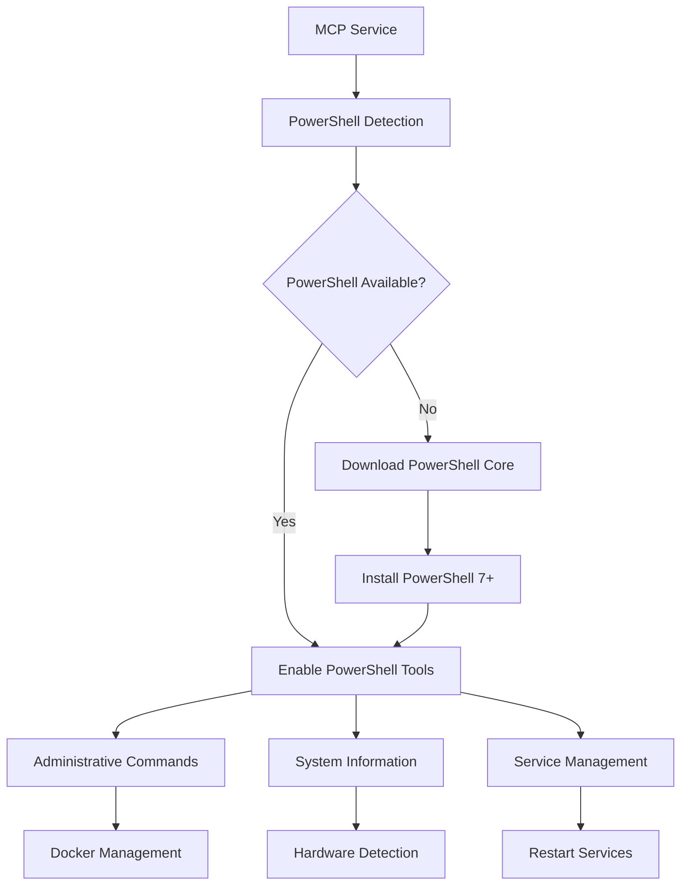

## Networking & Security (Windows)

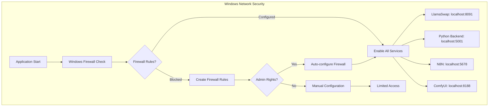

## Auto-Updates (Windows)

```mermaid
graph TD
    A[Auto-Update Check] --> B{New Version Available?}
    B -->|Yes| C[Download Update]
    B -->|No| D[Continue Normal Operation]
    
    C --> E[Verify Digital Signature]
    E --> F[Install Update (.exe)]
    F --> G[Registry Update]
    G --> H[Restart Application]
    
    H --> I[Migration Check]
    I --> J[Update Complete]
    
    subgraph "Update Sources"
        K[GitHub Releases]
        L[Electron Updater]
        M[Windows Code Signing]
    end
    
    C --> K
    C --> L
    E --> M
```

## Windows Services Integration

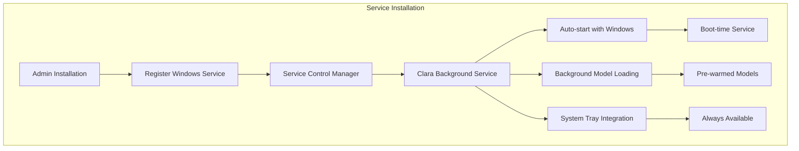

## Error Handling & Recovery (Windows)

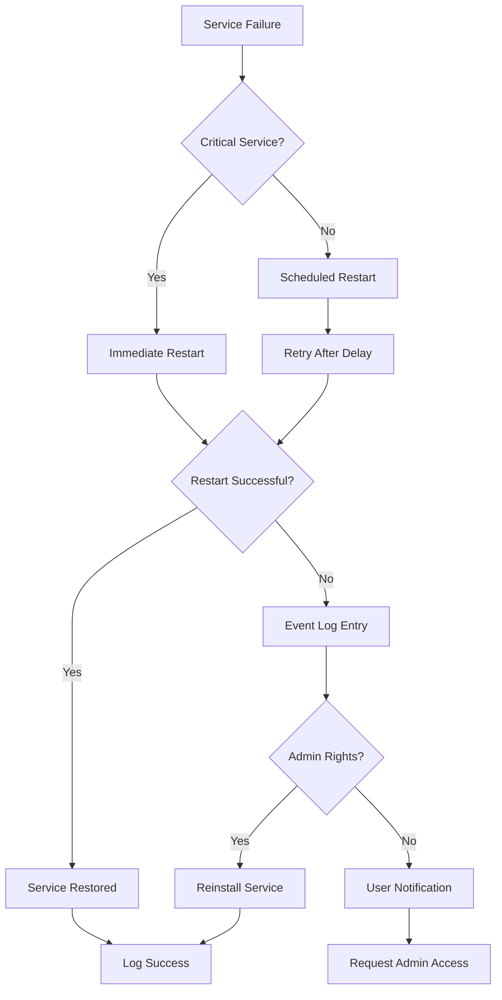

## Performance Optimization (Windows)

### CPU Optimization
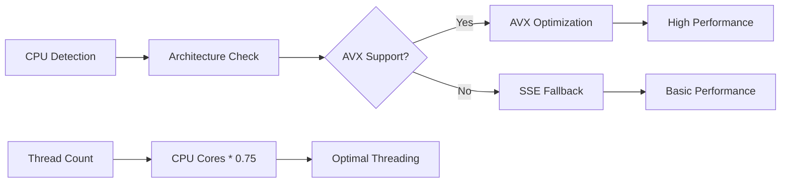

### Memory Management
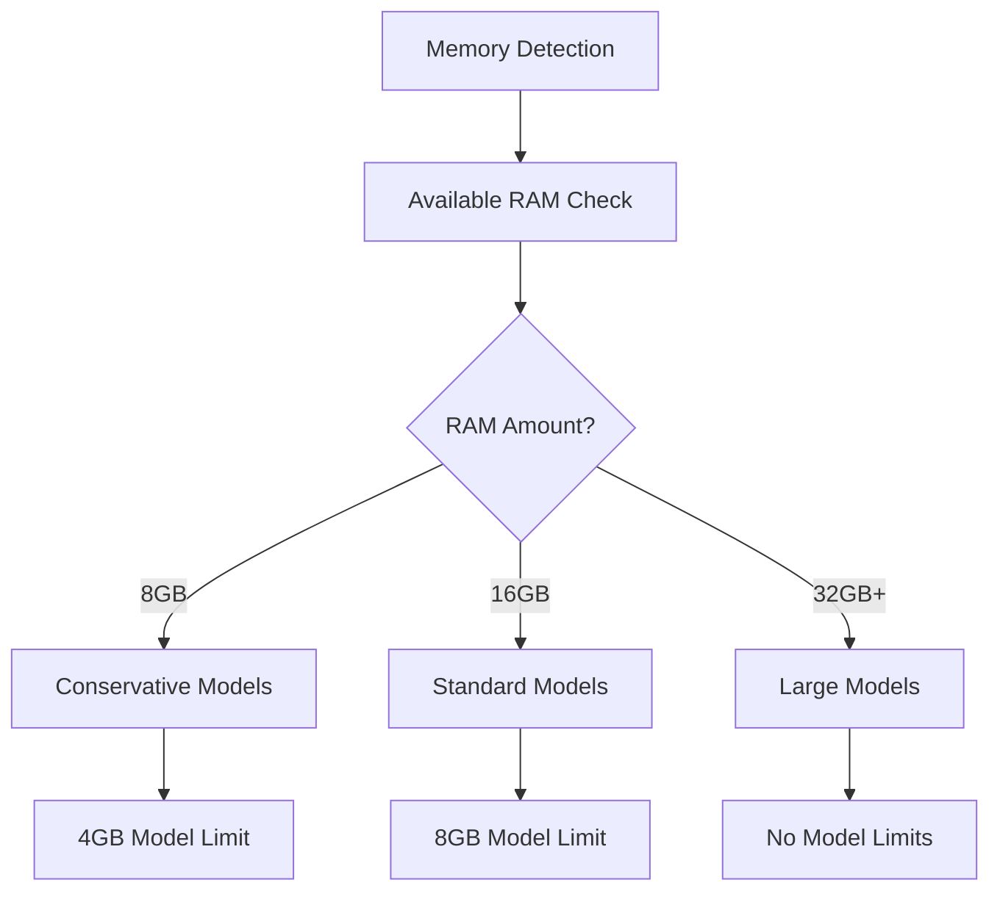

## Troubleshooting (Windows)

### Common Issues

#### Docker Desktop Not Starting
1. Check Windows version (Windows 10 2004+ or Windows 11)
2. Enable WSL2: `wsl --install`
3. Enable Hyper-V: `Enable-WindowsOptionalFeature -Online -FeatureName Microsoft-Hyper-V -All`
4. Check BIOS virtualization settings

#### CUDA Not Detected
1. Install NVIDIA drivers: Download from nvidia.com
2. Install CUDA Toolkit 12.6: `winget install NVIDIA.CUDA`
3. Verify installation: `nvcc --version`
4. Check PATH environment variable

#### Permission Denied Errors
1. Run as Administrator: Right-click → "Run as administrator"
2. Check Windows Firewall settings
3. Verify antivirus exclusions
4. Add Clara to Windows Defender exclusions

#### PowerShell Execution Policy
1. Open PowerShell as Administrator
2. Set execution policy: `Set-ExecutionPolicy RemoteSigned`
3. Verify: `Get-ExecutionPolicy`
4. Restart application

#### WSL2 Issues
1. Update WSL: `wsl --update`
2. Check WSL status: `wsl --status`
3. Restart WSL: `wsl --shutdown` then restart
4. Check Windows version compatibility

## Windows Registry Configuration

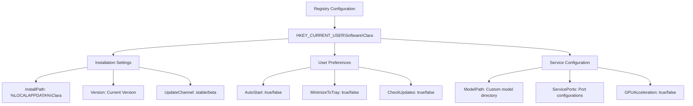

## System Requirements

### Minimum Requirements
- **OS**: Windows 10 version 2004 (Build 19041) or Windows 11
- **CPU**: Intel i5-8th gen / AMD Ryzen 5 2600 or equivalent
- **RAM**: 8GB RAM (16GB recommended)
- **Storage**: 10GB free space (50GB for full Docker mode)
- **GPU**: Optional NVIDIA GTX 1060 or newer for acceleration

### Recommended Requirements
- **OS**: Windows 11 with latest updates
- **CPU**: Intel i7-10th gen / AMD Ryzen 7 3700X or newer
- **RAM**: 16GB+ RAM (32GB for large models)
- **Storage**: SSD with 100GB+ free space
- **GPU**: NVIDIA RTX 3070 or newer with 8GB+ VRAM

## Summary

ClaraVerse on Windows provides a comprehensive AI development platform with:

- **Native Windows Integration**: Full support for Windows services, registry, and system features
- **Docker Desktop Support**: Complete containerized services via WSL2 backend
- **CUDA Acceleration**: Optimized NVIDIA GPU support for maximum performance
- **PowerShell Integration**: Administrative and system management capabilities
- **Enterprise Features**: Windows service installation, registry management, and enterprise deployment
- **Robust Error Handling**: Comprehensive error recovery and system integration

The Windows implementation prioritizes performance, security, and enterprise compatibility while maintaining the full feature set across both lightweight and Docker deployment modes. 